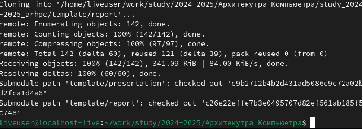
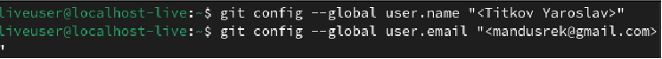
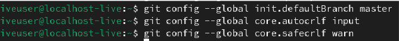
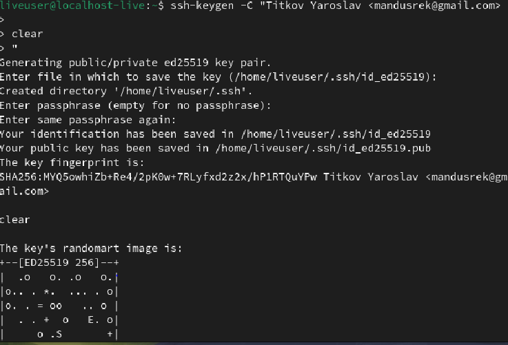
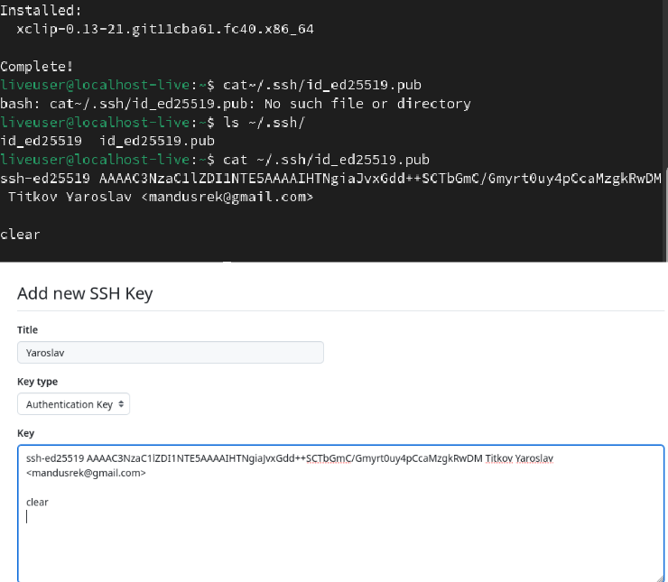
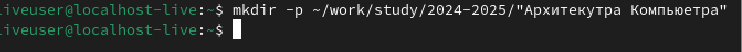
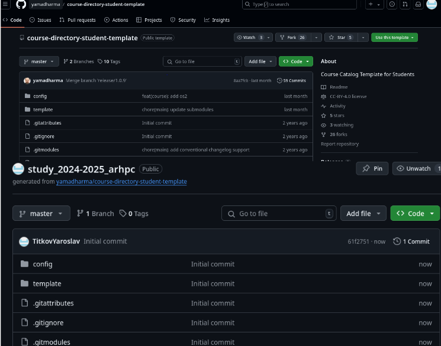
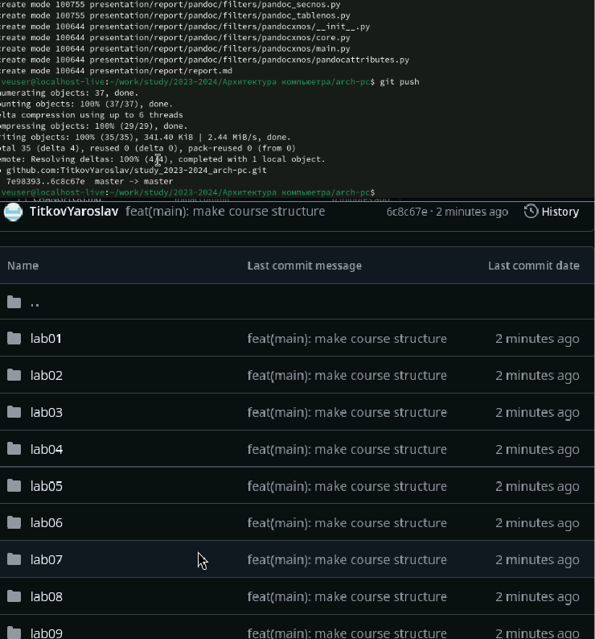
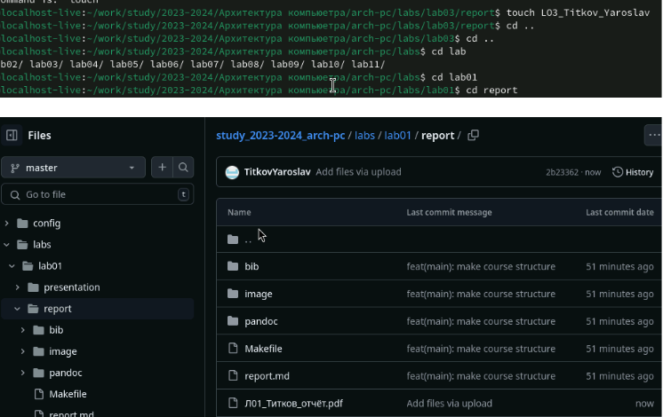

---
## Front matter
title: "Отчёт по лабораторной работе номер 2"
subtitle: "Архитектура комьютера"
author: "Титков Ярослав Максимович"

## Generic otions
lang: ru-RU
toc-title: "Содержание"

## Bibliography
bibliography: bib/cite.bib
csl: pandoc/csl/gost-r-7-0-5-2008-numeric.csl

## Pdf output format
toc: true # Table of contents
toc-depth: 2
lof: true # List of figures
lot: true # List of tables
fontsize: 12pt
linestretch: 1.5
papersize: a4
documentclass: scrreprt
## I18n polyglossia
polyglossia-lang:
  name: russian
  options:
	- spelling=modern
	- babelshorthands=true
polyglossia-otherlangs:
  name: english
## I18n babel
babel-lang: russian
babel-otherlangs: english
## Fonts
mainfont: IBM Plex Serif
romanfont: IBM Plex Serif
sansfont: IBM Plex Sans
monofont: IBM Plex Mono
mathfont: STIX Two Math
mainfontoptions: Ligatures=Common,Ligatures=TeX,Scale=0.94
romanfontoptions: Ligatures=Common,Ligatures=TeX,Scale=0.94
sansfontoptions: Ligatures=Common,Ligatures=TeX,Scale=MatchLowercase,Scale=0.94
monofontoptions: Scale=MatchLowercase,Scale=0.94,FakeStretch=0.9
mathfontoptions:
## Biblatex
biblatex: true
biblio-style: "gost-numeric"
biblatexoptions:
  - parentracker=true
  - backend=biber
  - hyperref=auto
  - language=auto
  - autolang=other*
  - citestyle=gost-numeric
## Pandoc-crossref LaTeX customization
figureTitle: "Рис."
tableTitle: "Таблица"
listingTitle: "Листинг"
lofTitle: "Список иллюстраций"
lotTitle: "Список таблиц"
lolTitle: "Листинги"
## Misc options
indent: true
header-includes:
  - \usepackage{indentfirst}
  - \usepackage{float} # keep figures where there are in the text
  - \floatplacement{figure}{H} # keep figures where there are in the text
---

# Цель работы
Целью работы является изучить идеологию и применение средств контроля версий.
Приобрести практические навыки по работе с системой git.

# Задание
1. Настройка GitHub.
2. Базовая настройка Git.
3. Создание SSH-ключа.
4. Создание рабочего пространства и репозитория курса на основе шаблона.
5. Создание репозитория курса на основе шаблона.
6. Настройка каталога курса.
7. Выполнение заданий для самостоятельной работы

# Теоретическое введение
истемы контроля версий (Version Control System, VCS) применяются при работе
нескольких человек над одним проектом. Обычно основное дерево проекта хранится в
локальном или удалённом репозитории, к которому настроен доступ для участников
проекта. При внесении изменений в содержание проекта система контроля версий
позволяет их фиксировать, совмещать изменения, произведённые разными
участниками проекта, производить откат к любой более ранней версии проекта, если
это требуется. В классических системах контроля версий используется
централизованная модель, предполагающая наличие единого репозитория для хранения
файлов. Выполнение большинства функций по управлению версиями осуществляется
специальным сервером. Участник проекта (пользователь) перед началом работы
посредством определённых команд получает нужную ему версию файлов. После
внесения изменений, пользователь размещает новую версию в хранилище. При этом
предыдущие версии не удаляются из центрального хранилища и к ним можно
вернуться в любой момент. Сервер может сохранять не полную версию изменённых
файлов, а производить так называемую дельта-компрессию — сохранять только
изменения между последовательными версиями, что позволяет уменьшить объём
хранимых данных. Системы контроля версий поддерживают возможность
отслеживания и разрешения конфликтов, которые могут возникнуть при работе
нескольких человек над одним файлом. Можно объединить (слить) изменения,
сделанные разными участниками (автоматически или вручную), вручную выбрать
нужную версию, отменить изменения вовсе или заблокировать файлы для изменения. В
зависимости от настроек блокировка не позволяет другим пользователям получить
рабочую копию или препятствует изменению рабочей копии файла средствами
файловой системы ОС, обеспечивая таким образом, привилегированный доступ только
одному пользователю, работающему с файлом. Системы контроля версий также могут
обеспечивать дополнительные, более гибкие функциональные возможности. Например,
они могут поддерживать работу с несколькими версиями одного файла, сохраняя
общую историю изменений до точки ветвления версий и собственные истории
изменений каждой ветви. Кроме того, обычно доступна информация о том, кто из
участников, когда и какие изменения вносил. Обычно такого рода информация
хранится в журнале изменений, доступ к которому можно ограничить. В отличие от
классических, в распределённых системах контроля версий центральный репозиторий
не является обязательным. Среди классических VCS наиболее известны CVS,
Subversion, а среди распределённых — Git, Bazaar, Mercurial. Принципы их работы
схожи, отличаются они в основном синтаксисом используемых в работе команд 

# Выполнение лабораторной работы
1.Создал учётную запись github:
{#fig:001 width=70%}
Сначала сделал предварительную конфигурацию git. Открыл терминал и ввёл все
данные:
{#fig:002  width=70%}
 Настроил utf-8 в выводе сообщений git:
 {#fig:003 width=70%}
 Задаю имя начальной ветки Master, параметр autocrlf со значением input, чтобы
конвертировать CRLF в L, параметр safecrlf со значением warn
{#fig:004  width=70%}
Для последующей идентификации пользователя на сервере репозиториев
сгенерировал пару ключей (приватный и открытый):
{#fig:005  width=70%}
Захожу на сайт GitHub. Открываю свой профиль и выбираю страницу «SSH and GPG
keys». Нажимаю кнопку «New SSH key». Вставляю скопированный ключ в поле «Key»
{#fig:006  width=70%}
Открыл терминал и создал каталог для предмета «Архитектура компьютера»
{#fig:007  width=70%}
Репозиторий на основе шаблона создал через web-интерфейс github. Перешёл на
станицу репозитория с шаблоном курса https://github.com/yamadharma/cour se-directory-student-template. Далее выберал Use this template:
{#fig:008  width=70%}
Клонирую созданный репозиторий с помощью команды git clone –recursive
git@github.com:/study_2024–2025_arh-pc.git arch-pc:
{#fig:009  width=70%}
Настроил каталог курса, удалил лишние файлы, затем создал необходимые каталоги
и загрузил все на сервер:
{#fig:010 width=70%}
{#fig:011 width=70%}
Задания для самостоятельной работы:

Я создал отчёт по выполнению лабораторной работы в соответствующем каталоге
рабочего пространства (labs > lab02 > report).
Скопировал отчёты по выполнению предыдущих лабораторных работ в
соответствующие каталоги созданного рабочего пространства.
Загрузил файлы на GitHub.
{#fig:012 width=70%}

# Выводы
В ходе выполнения лабораторной работы была достигнута её цель — изучены
идеология и применение средств контроля версий, а также приобретены практические
навыки по работе с системой Git.

