---
## Front matter
title: "Лабораторная работа номер 6"
subtitle: "Архитектура компьютера"
author: "Титков Ярослав Максимович"

## Generic otions
lang: ru-RU
toc-title: "Содержание"

## Bibliography
bibliography: bib/cite.bib
csl: pandoc/csl/gost-r-7-0-5-2008-numeric.csl

## Pdf output format
toc: true # Table of contents
toc-depth: 2
lof: true # List of figures
lot: true # List of tables
fontsize: 12pt
linestretch: 1.5
papersize: a4
documentclass: scrreprt
## I18n polyglossia
polyglossia-lang:
  name: russian
  options:
	- spelling=modern
	- babelshorthands=true
polyglossia-otherlangs:
  name: english
## I18n babel
babel-lang: russian
babel-otherlangs: english
## Fonts
mainfont: IBM Plex Serif
romanfont: IBM Plex Serif
sansfont: IBM Plex Sans
monofont: IBM Plex Mono
mathfont: STIX Two Math
mainfontoptions: Ligatures=Common,Ligatures=TeX,Scale=0.94
romanfontoptions: Ligatures=Common,Ligatures=TeX,Scale=0.94
sansfontoptions: Ligatures=Common,Ligatures=TeX,Scale=MatchLowercase,Scale=0.94
monofontoptions: Scale=MatchLowercase,Scale=0.94,FakeStretch=0.9
mathfontoptions:
## Biblatex
biblatex: true
biblio-style: "gost-numeric"
biblatexoptions:
  - parentracker=true
  - backend=biber
  - hyperref=auto
  - language=auto
  - autolang=other*
  - citestyle=gost-numeric
## Pandoc-crossref LaTeX customization
figureTitle: "Рис."
tableTitle: "Таблица"
listingTitle: "Листинг"
lofTitle: "Список иллюстраций"
lotTitle: "Список таблиц"
lolTitle: "Листинги"
## Misc options
indent: true
header-includes:
  - \usepackage{indentfirst}
  - \usepackage{float} # keep figures where there are in the text
  - \floatplacement{figure}{H} # keep figures where there are in the text
---

# Цель работы
Цель данной лабораторной работы - освоение арифметческих инструкций
языка ассемблера NASM.

# Задание
1. Символьные и численные данные в NASM
2. Выполнение арифметических операций в NASM
3. Выполнение заданий для самостоятельной работы

# Теоретическое введение
Большинство инструкций на языке ассемблера требуют обработки операндов.
Адрес операнда предоставляет место, где хранятся данные, подлежащие обра-
ботке. Это могут быть данные хранящиеся в регистре или в ячейке памяти. -
Регистровая адресация – операнды хранятся в регистрах и в команде использу-
ются имена этих регистров, например: mov ax,bx. - Непосредственная адресация
– значение операнда задается непосредственно в команде, Например: mov ax,2.
- Адресация памяти – операнд задает адрес в памяти. В команде указывается
символическое обозначение ячейки памяти, над содержимым которой требуется
выполнить операцию.
Ввод информации с клавиатуры и вывод её на экран осуществляется в символь-
ном виде. Кодирование этой информации производится согласно кодовой табли-
це символов ASCII. ASCII – сокращение от American Standard Code for Information
Interchange (Американский стандартный код для обмена информацией). Соглас-
но стандарту ASCII каждый символ кодируется одним байтом. Среди инструкций
NASM нет такой, которая выводит числа (не в символьном виде). Поэтому, на-
пример, чтобы вывести число, надо предварительно преобразовать его цифры в
ASCII-коды этих цифр и выводить на экран эти коды, а не само число. Если же
выводить число на экран непосредственно, то экран воспримет его не как число,
а как последовательность ASCII-символов – каждый байт числа будет воспринят
как один ASCII-символ – и выведет на экран эти символы. Аналогичная ситу-
ация происходит и при вводе данных с клавиатуры. Введенные данные будут
представлять собой символы, что сделает невозможным получение корректного
результата при выполнении над ними арифметических операций. Для решения
этой проблемы необходимо проводить преобразование ASCII символов в числа
и обратно

# Выполнение лабораторной работы

## Данные в NASM

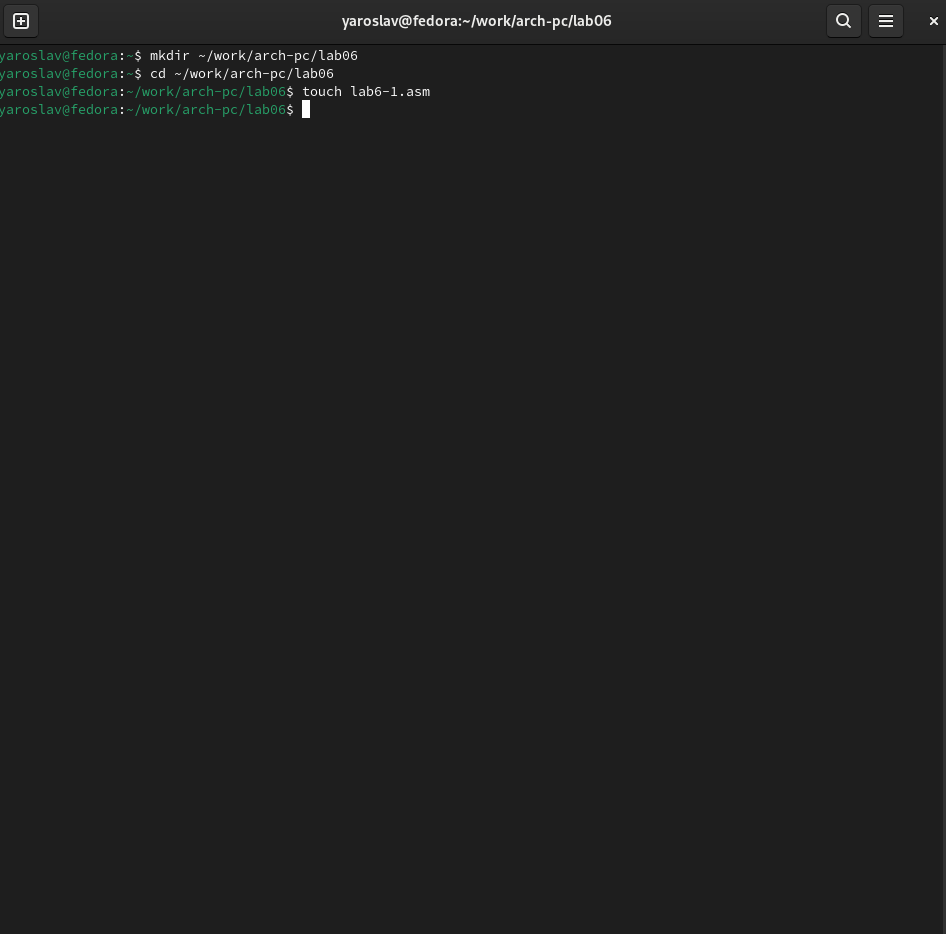{#fig:001 width=70%}

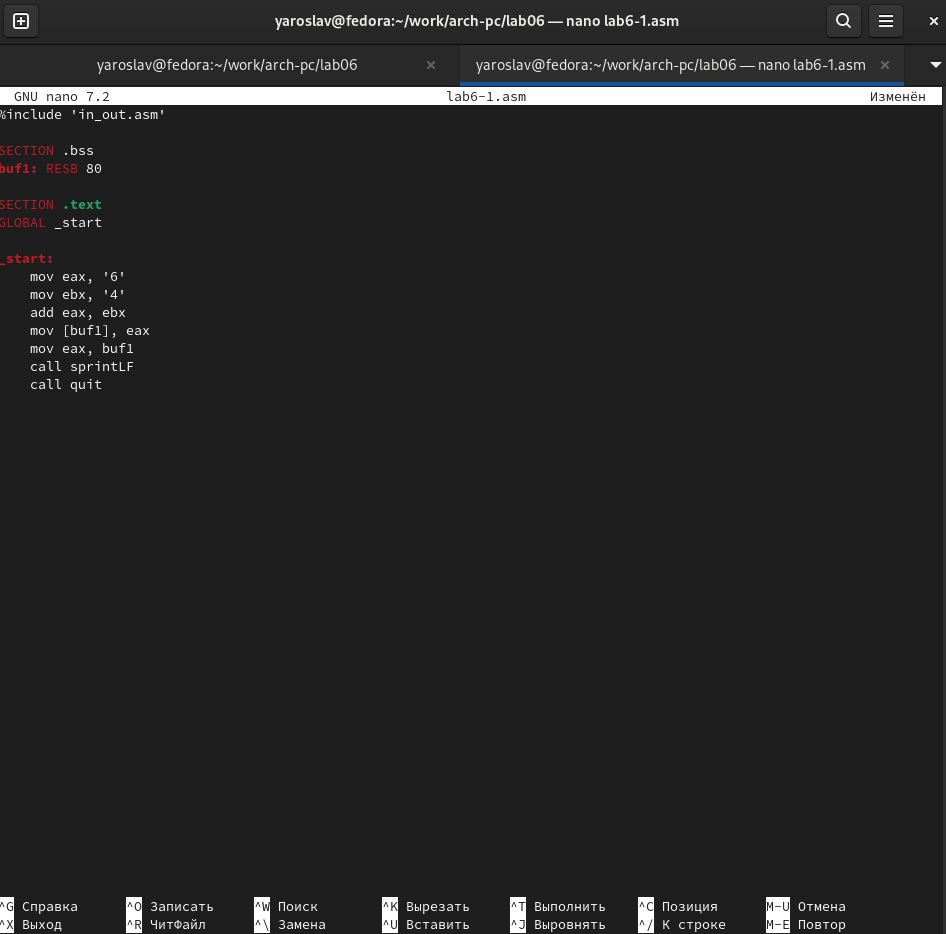{#fig:002 width=70%}

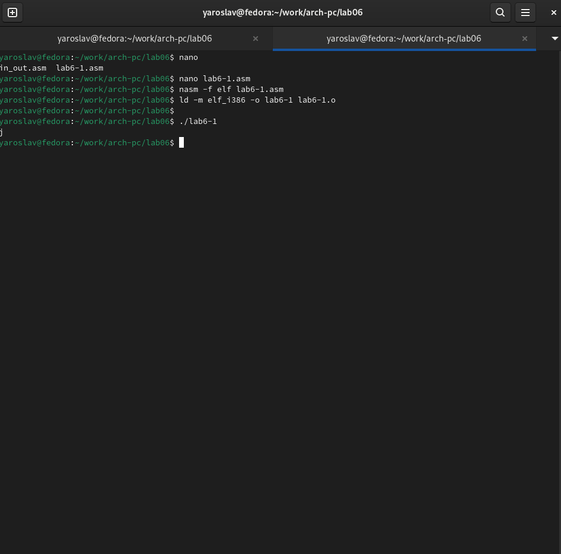{#fig:003 width=70%}

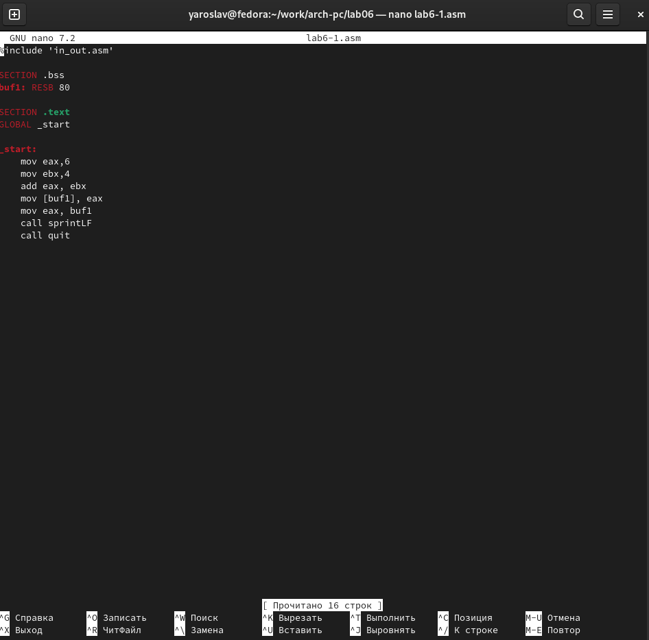{#fig:004 width=70%}

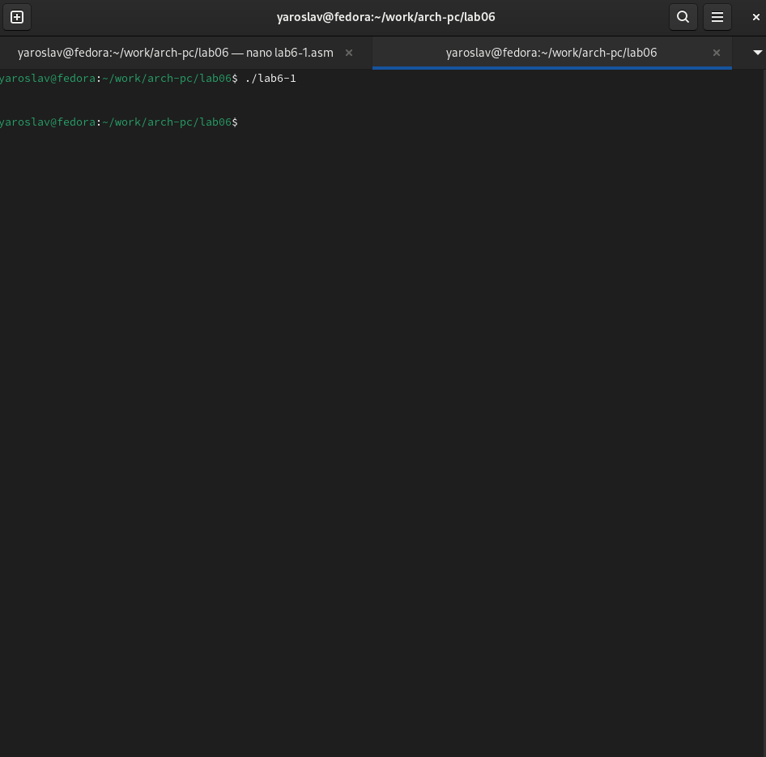{#fig:005 width=70%}

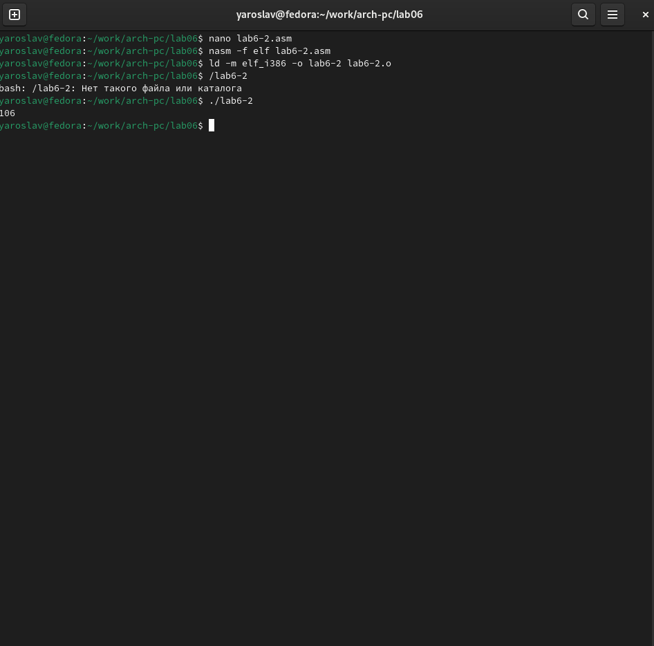{#fig:006 width=70%}

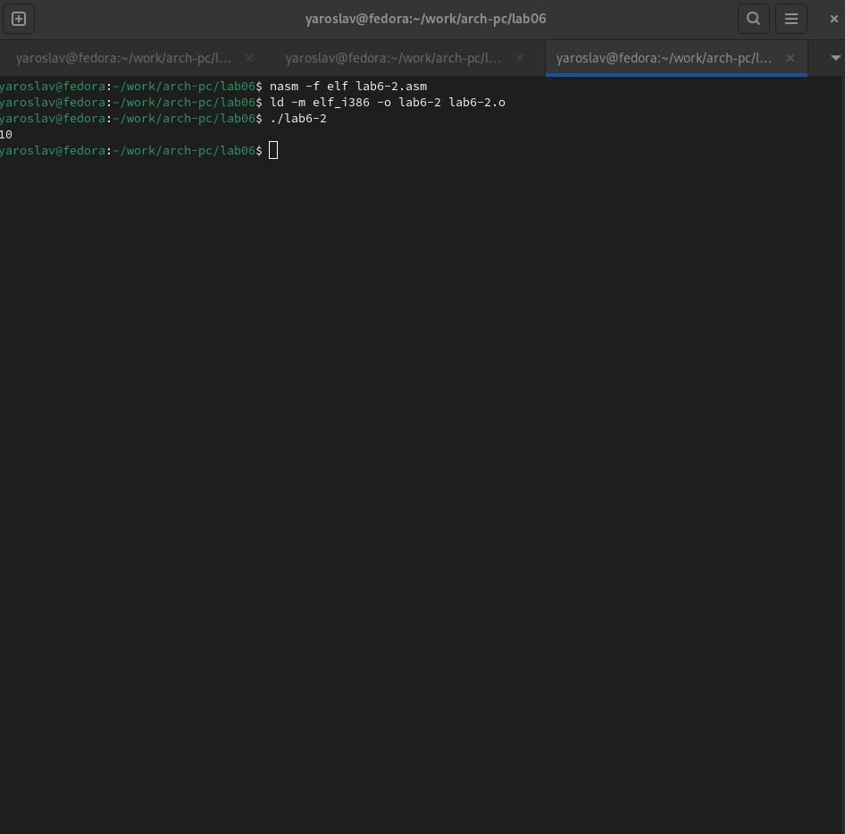{#fig:007 width=70%}

## Выполнение арифметических операций в NASM

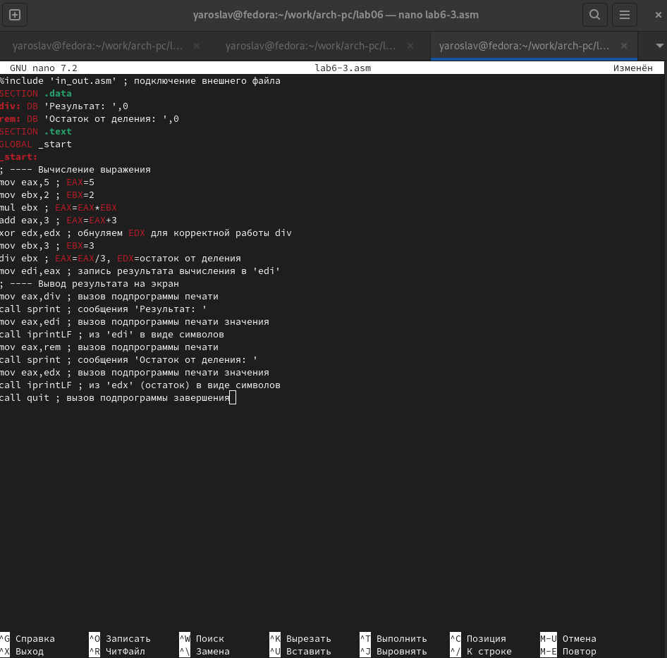{#fig:008 width=70%}

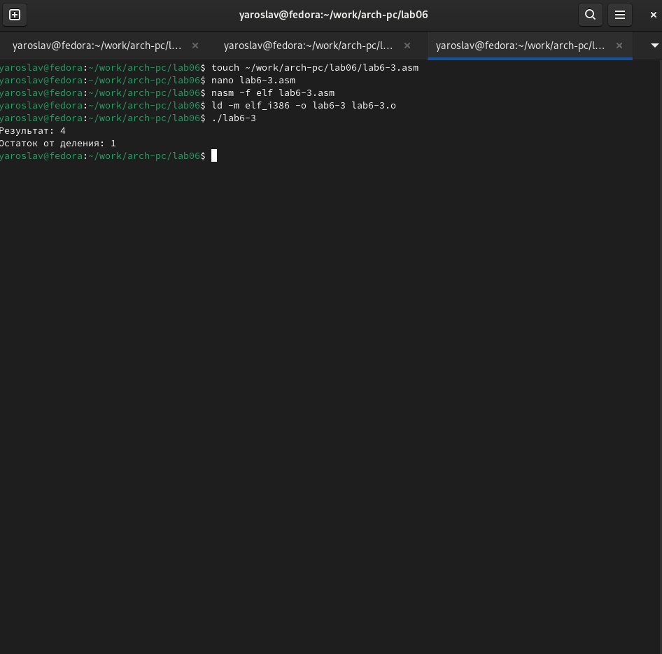{#fig:009 width=70%}

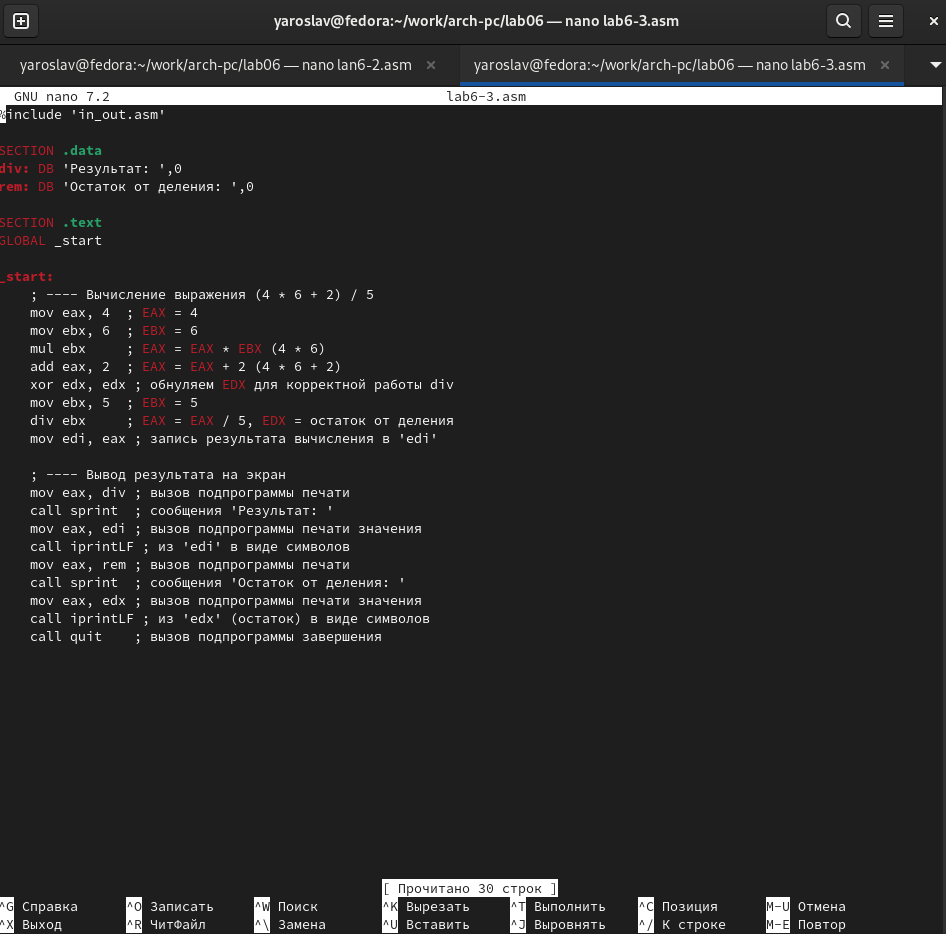{#fig:010 width=70%}

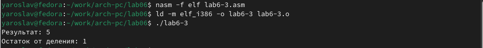{#fig:011 width=70%}

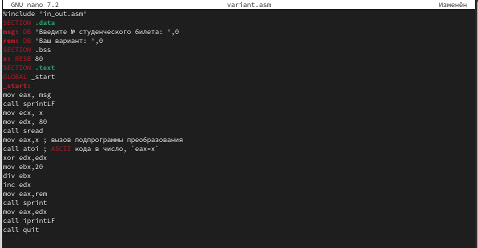{#fig:012 width=70%} 

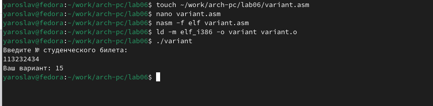{#fig:013 width=70%}

## Ответы на вопросы:
 
 1:mov eax, rem
   call sprint
 
 2:Эти инструкции используются для чтения строки ввода пользователя и сохранения её в переменную x.
 
 3:Инструкция call atoi используется для преобразования строки, хранящейся в eax, в целое число.
 
 4:xor edx,edx
   mov ebx,20
   div ebx
   inc edx
 
 5:Остаток от деления записывается в регистр edx.
 
 6:Инструкция inc edx используется для увеличения остатка от деления на 1, чтобы получить номер варианта.
 
 7:mov eax, edx
   call iprintLF

## Задания для самостоятельной работы:
Написать программу вычисления выражения 𝑦 = 𝑓(𝑥). Программа должна выводить
выражение для вычисления, выводить запрос на ввод значения 𝑥, вычислять задан-
ное выражение в зависимости от введенного 𝑥, выводить результат вычислений. Вид
функции 𝑓(𝑥) выбрать из таблицы 6.3 вариантов заданий в соответствии с номером
полученным при выполнении лабораторной работы. 

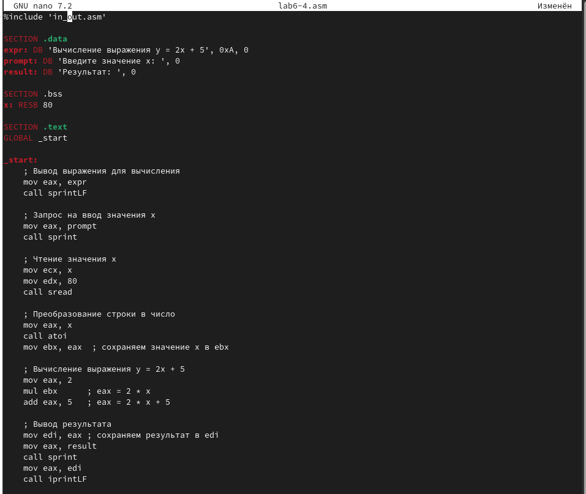{#fig:014 width=70%}

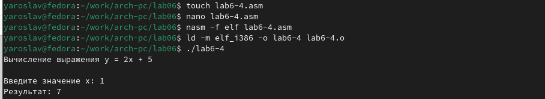{#fig:015 width=70%}

# Выводы
При выполнении данной лабораторной работы я освоила арифметические
инструкции языка ассемблера NASM.

