---
## Front matter
title: "Лабораторная работа номер 7"
subtitle: "Архитектура компьютера"
author: "Титков Ярослав Максимович"

## Generic otions
lang: ru-RU
toc-title: "Содержание"

## Bibliography
bibliography: bib/cite.bib
csl: pandoc/csl/gost-r-7-0-5-2008-numeric.csl

## Pdf output format
toc: true # Table of contents
toc-depth: 2
lof: true # List of figures
lot: true # List of tables
fontsize: 12pt
linestretch: 1.5
papersize: a4
documentclass: scrreprt
## I18n polyglossia
polyglossia-lang:
  name: russian
  options:
	- spelling=modern
	- babelshorthands=true
polyglossia-otherlangs:
  name: english
## I18n babel
babel-lang: russian
babel-otherlangs: english
## Fonts
mainfont: IBM Plex Serif
romanfont: IBM Plex Serif
sansfont: IBM Plex Sans
monofont: IBM Plex Mono
mathfont: STIX Two Math
mainfontoptions: Ligatures=Common,Ligatures=TeX,Scale=0.94
romanfontoptions: Ligatures=Common,Ligatures=TeX,Scale=0.94
sansfontoptions: Ligatures=Common,Ligatures=TeX,Scale=MatchLowercase,Scale=0.94
monofontoptions: Scale=MatchLowercase,Scale=0.94,FakeStretch=0.9
mathfontoptions:
## Biblatex
biblatex: true
biblio-style: "gost-numeric"
biblatexoptions:
  - parentracker=true
  - backend=biber
  - hyperref=auto
  - language=auto
  - autolang=other*
  - citestyle=gost-numeric
## Pandoc-crossref LaTeX customization
figureTitle: "Рис."
tableTitle: "Таблица"
listingTitle: "Листинг"
lofTitle: "Список иллюстраций"
lotTitle: "Список таблиц"
lolTitle: "Листинги"
## Misc options
indent: true
header-includes:
  - \usepackage{indentfirst}
  - \usepackage{float} # keep figures where there are in the text
  - \floatplacement{figure}{H} # keep figures where there are in the text
---

# Цель работы
Изучение команд условного и безусловного переходов. Приобретение навыков написания
программ с использованием переходов. Знакомство с назначением и структурой файла
листинга.

# Задание

1. Реализация переходов в NASM
2. Изучение структуры файлы листинга
3. Задание для самостоятельной работы

# Теоретическое введение
Для реализации ветвлений в ассемблере используются так называемые команды передачи управления или команды перехода. Существует два типа переходов: условный и безусловный. Безусловный переход выполняется инструкцией `jmp` (от англ. jump – прыжок), которая включает в себя адрес перехода, куда следует передать управление: `jmp <адрес_перехода>`. Адрес перехода может быть либо меткой, либо адресом области памяти, в которую предварительно помещен указатель перехода. В качестве операнда можно также использовать имя регистра, в таком случае переход будет осуществляться по адресу, хранящемуся в этом регистре.

Условный переход, в отличие от безусловного, требует проверки определенного условия. В ассемблере команды условного перехода анализируют флаги из регистра флагов для определения необходимости перехода. Флаг – это бит, принимающий значение 1 («флаг установлен»), если выполнено некоторое условие, и значение 0 («флаг сброшен») в противном случае. Флаги работают независимо друг от друга и помещены в единый регистр — регистр флагов, отражающий текущее состояние процессора.

Инструкция `cmp` является одной из команд, которая позволяет сравнить операнды и выставить флаги в зависимости от результата сравнения. Формат команды `cmp` аналогичен команде вычитания: `cmp <операнд_1>, <операнд_2>`. Команда `cmp` выполняет вычитание `<операнд_2> - <операнд_1>`, но результат вычитания никуда не записывается, и единственным результатом команды сравнения является формирование флагов.

Команда условного перехода имеет вид `j<мнемоника перехода> label`, где мнемоника перехода связана со значением анализируемых флагов или со способом формирования этих флагов. В таблице представлены команды условного перехода, которые обычно ставятся после команды сравнения `cmp`. В их мнемокодах указывается тот результат сравнения, при котором надо делать переход. Мнемоники, идентичные по своему действию, написаны в таблице через дробь (например, `ja` и `jnbe`). Программист выбирает, какую из них применить, чтобы получить более простой для понимания текст программы.

Листинг (в рамках понятийного аппарата NASM) — это один из выходных файлов, создаваемых транслятором. Он имеет текстовый вид и нужен при отладке программы, так как кроме строк самой программы он содержит дополнительную информацию. Ниже приведён фрагмент файла листинга.

# Выполнение лабораторной работы
## Реализация переходов в NASM:

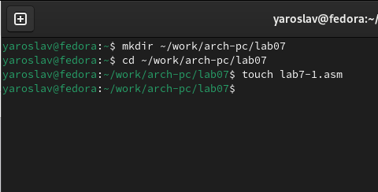{#fig:001  width=70%}

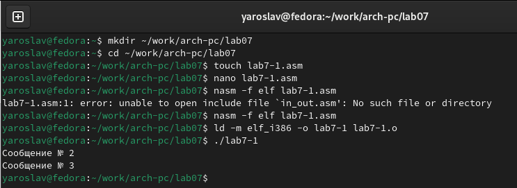{#fig:002  width=70%}

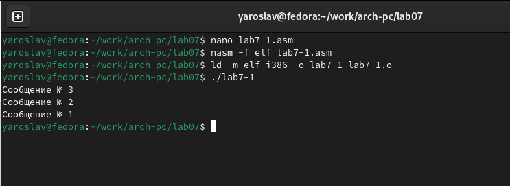{#fig:003  width=70%}

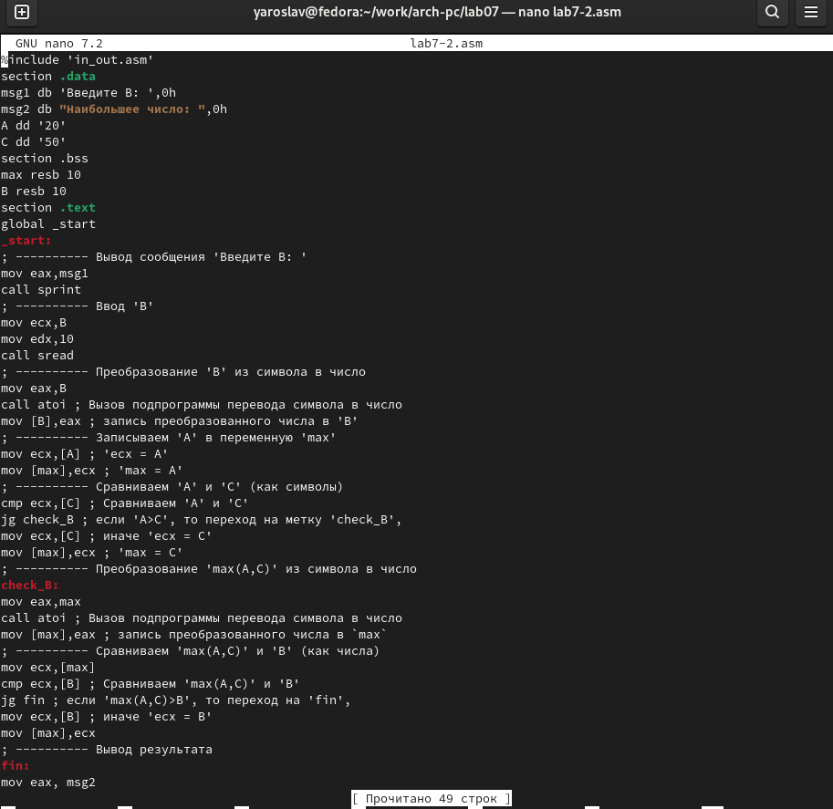{#fig:004  width=70%}

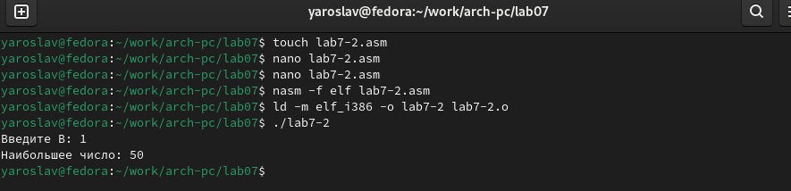{#fig:005  width=70%}

##  Изучение структуры файла листинга:

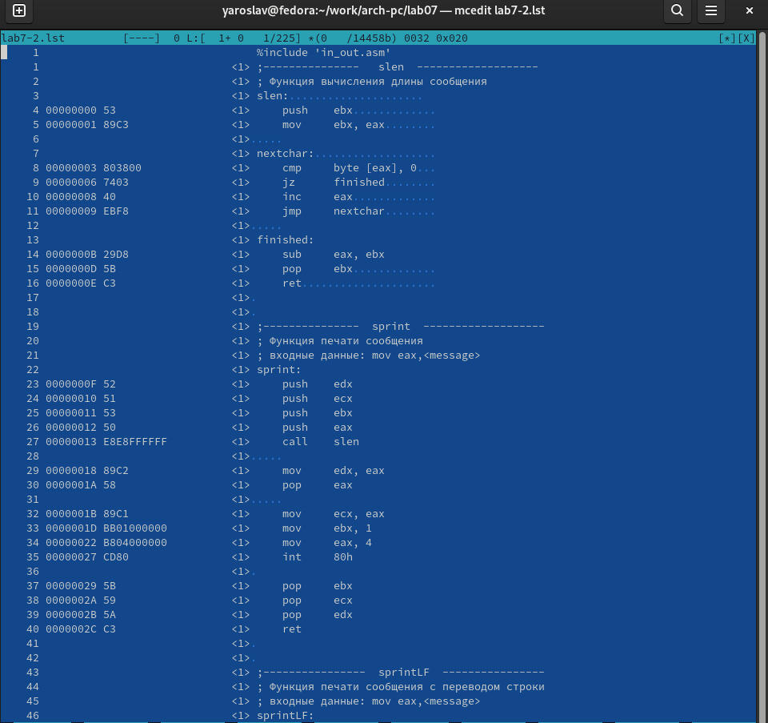{#fig:006  width=70%}

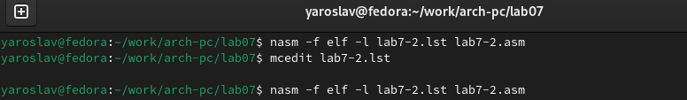{#fig:007  width=70%}

##  Ответы на вопросы:

`1`
      -f elf: Указывает формат объектного файла (ELF).
      -l lab7-2.lst: Указывает имя файла листинга, который будет создан.
       lab7-2.asm: Исходный файл ассемблера, который будет ассемблирован.
    
`2` 
    Формат и содержимое файла листинга:

        файл листинга (lab7-2.lst) содержит следующие основные элементы:
        Номер строки: Указывает номер строки в исходном файле.
        Адрес: Указывает адрес команды в памяти.
        Машинный код: Отображает машинный код, соответствующий команде.
        Исходный код: Отображает исходную строку ассемблера.
    
`3` 
   
   1.   
       10  00000000  B800000000        mov eax, 0:
        10 Номер строки в исходном файле.
        00000000: Адрес команды в памяти.
        B800000000: Машинный код команды mov eax, 0.
        mov eax, 0: Исходная строка ассемблера, которая загружает значение 0 в регистр eax.
    
    
   2.  15  00000005  89C3              mov ebx, eax:
        0: Номер строки в исходном файле.
        00000000: Адрес команды в памяти.
        B800000000: Машинный код команды mov eax, 0.
        mov eax, 0: Исходная строка ассемблера, которая загружает значение 0 в регистр eax.

   3.  20  00000007  CD80              int 0x80:
        20: Номер строки в исходном файле.
        00000007: Адрес команды в памяти.
        CD80: Машинный код команды int 0x80.
        int 0x80: Исходная строка ассемблера, которая вызывает прерывание 0x80 для выполнения системного вызова.
    
 `4`

   1. Что создаётся:
    
        Файл листинга (lab7-2.lst): Этот файл будет создан, но он будет содержать информацию об ошибке, 
        так как трансляция не может быть успешно завершена из-за неполной инструкции.
        Объектный файл (lab7-2.o): Этот файл не будет создан, так как трансляция завершится с ошибкой.
    
    
   2. Что добавляется:
        В файле листинга (lab7-2.lst) будет добавлена информация об ошибке, указывающая на неполную инструкцию
     
     
     
     
##  Задания для самостоятельной работы:

1. Напишите программу нахождения наименьшей из 3 целочисленных переменных a,b и .
Значения переменных выбрать из табл. 7.5 в соответствии с вариантом, полученным
при выполнении лабораторной работы № 7. Создайте исполняемый файл и проверьте
его работу.

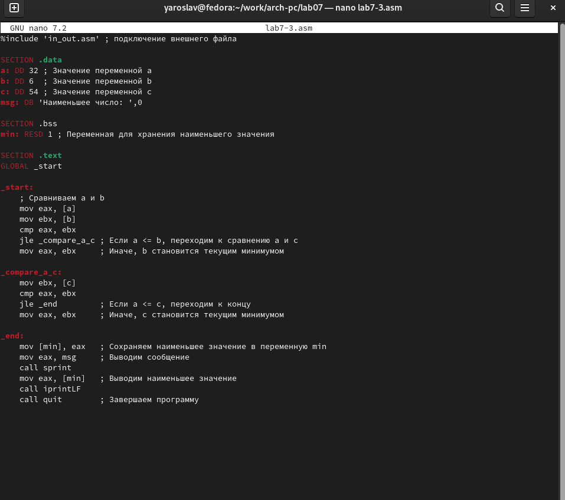{#fig:008  width=70%}

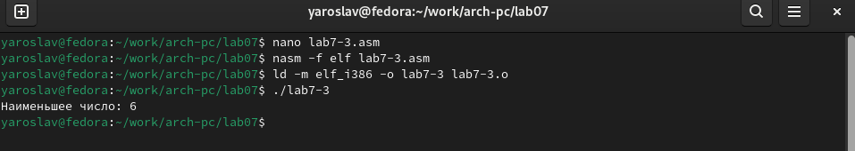{#fig:009  width=70%}

2. Напишите программу, которая для введенных с клавиатуры значений x и a вычисляет
значение заданной функции f(x) и выводит результат вычислений. Вид функции f(x)
выбрать из таблицы 7.6 вариантов заданий в соответствии с вариантом, полученным
при выполнении лабораторной работы номер 7. Создайте исполняемый файл и проверьте
его работу для значений x и a из 7.6.

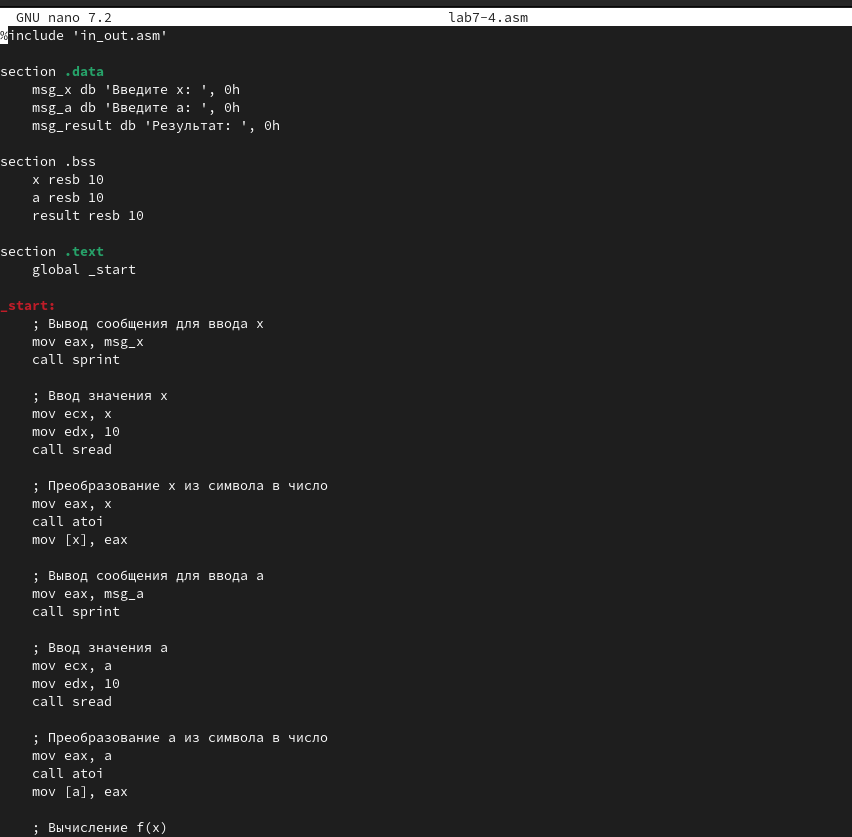{#fig:010  width=70%}

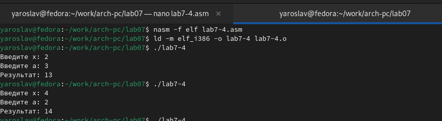{#fig:011  width=70%}

   
    
# Выводы

В ходе выполнения лабораторной работы были изучены команды условного и безусловного переходов в ассемблере, что позволило приобрести навыки написания программ с использованием переходов. Команды переходов являются ключевыми для управления потоком выполнения программы, что позволяет реализовывать сложные алгоритмы и логические конструкции.

