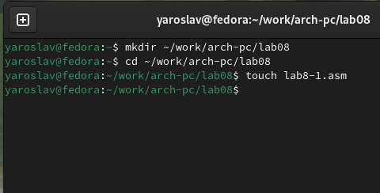
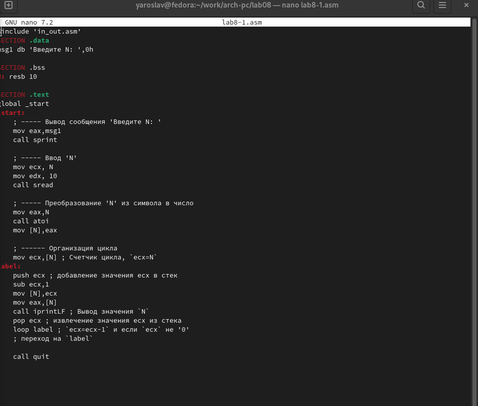
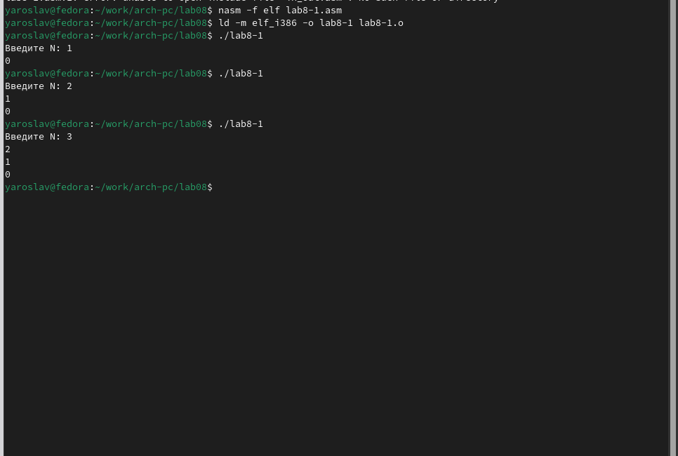
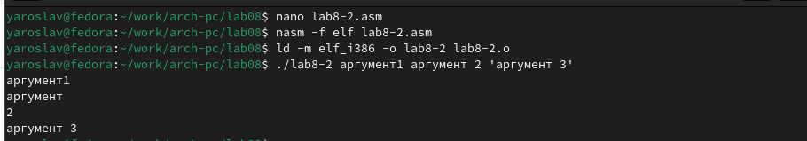
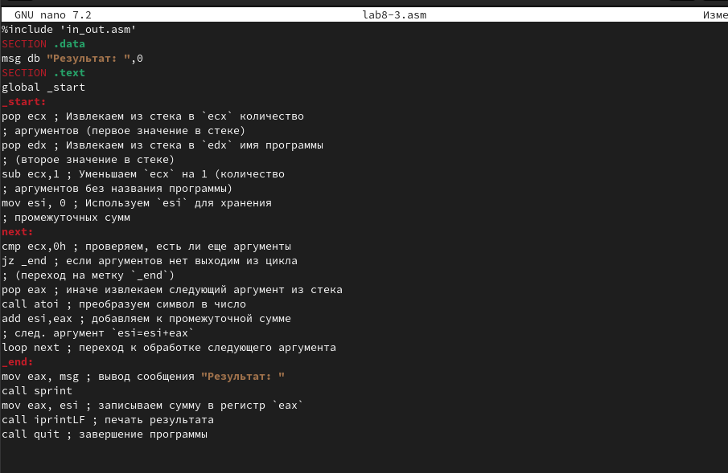
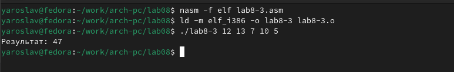
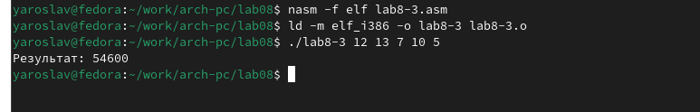
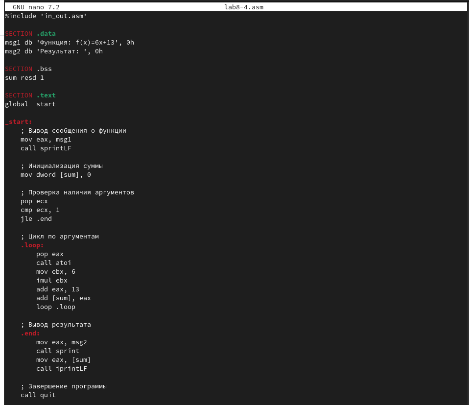
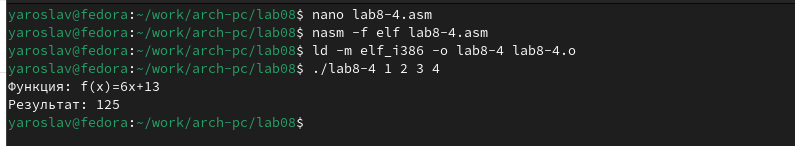

---
## Front matter
title: "Лабораторная работа номер 8"
subtitle: "Архитектура компьютера"
author: "Титков Ярослав Максимович"

## Generic otions
lang: ru-RU
toc-title: "Содержание"

## Bibliography
bibliography: bib/cite.bib
csl: pandoc/csl/gost-r-7-0-5-2008-numeric.csl

## Pdf output format
toc: true # Table of contents
toc-depth: 2
lof: true # List of figures
fontsize: 12pt
linestretch: 1.5
papersize: a4
documentclass: scrreprt
## I18n polyglossia
polyglossia-lang:
  name: russian
  options:
	- spelling=modern
	- babelshorthands=true
polyglossia-otherlangs:
  name: english
## I18n babel
babel-lang: russian
babel-otherlangs: english
## Fonts
mainfont: IBM Plex Serif
romanfont: IBM Plex Serif
sansfont: IBM Plex Sans
monofont: IBM Plex Mono
mathfont: STIX Two Math
mainfontoptions: Ligatures=Common,Ligatures=TeX,Scale=0.94
romanfontoptions: Ligatures=Common,Ligatures=TeX,Scale=0.94
sansfontoptions: Ligatures=Common,Ligatures=TeX,Scale=MatchLowercase,Scale=0.94
monofontoptions: Scale=MatchLowercase,Scale=0.94,FakeStretch=0.9
mathfontoptions:
## Biblatex
biblatex: true
biblio-style: "gost-numeric"
biblatexoptions:
  - parentracker=true
  - backend=biber
  - hyperref=auto
  - language=auto
  - autolang=other*
  - citestyle=gost-numeric
## Pandoc-crossref LaTeX customization
figureTitle: "Рис."
tableTitle: "Таблица"
listingTitle: "Листинг"
lofTitle: "Список иллюстраций"
lolTitle: "Листинги"
## Misc options
indent: true
header-includes:
  - \usepackage{indentfirst}
  - \usepackage{float} # keep figures where there are in the text
  - \floatplacement{figure}{H} # keep figures where there are in the text
---

# Цель работы
Приобретение навыков написания программ с использованием циклов и обработкой
аргументов командной строки.

# Задание

1. Реализация циклов в NASM
2. Обработка аргументов командной строки
3. Задание для самостоятельной работы

# Теоретическое введение

тек — это структура данных, организованная по принципу LIFO («Last In — First Out»
или «последним пришёл — первым ушёл»). Стек является частью архитектуры процессора и
реализован на аппаратном уровне. Для работы со стеком в процессоре есть специальные
регистры (ss, bp, sp) и команды.
Основной функцией стека является функция сохранения адресов возврата и передачи
аргументов при вызове процедур. Кроме того, в нём выделяется память для локальных
переменных и могут временно храниться значения регистров.Стек имеет вершину, адрес последнего добавленного элемента, который хранится в ре-
гистре esp (указатель стека). Противоположный конец стека называется дном. Значение,
помещённое в стек последним, извлекается первым. При помещении значения в стек указа-
тель стека уменьшается, а при извлечении — увеличивается.
Для стека существует две основные операции:
• добавление элемента в вершину стека (push);
• извлечение элемента из вершины стека (pop)
оманда push размещает значение в стеке, т.е. помещает значение в ячейку памяти, на
которую указывает регистр esp, после этого значение регистра esp увеличивается на 4.
Данная команда имеет один операнд — значение, которое необходимо поместить в стек.Существует ещё две команды для добавления значений в стек. Это команда pusha, которая помещает в стек содержимое всех регистров общего назначения в следующем порядке: ах,
сх, dx, bх, sp, bp, si, di. А также команда pushf, которая служит для перемещения в стек
содержимого регистра флагов. Обе эти команды не имеют операндов.Команда pop извлекает значение из стека, т.е. извлекает значение из ячейки памяти, на которую указывает регистр esp, после этого уменьшает значение регистра esp на 4. У этой
команды также один операнд, который может быть регистром или переменной в памяти.
Нужно помнить, что извлечённый из стека элемент не стирается из памяти и остаётся как
“мусор”, который будет перезаписан при записи нового значения в стек. налогично команде записи в стек существует команда popa, которая восстанавливает из стека все регистры общего назначения, и команда popf для перемещения значений из
вершины стека в регистр флаг. Для организации циклов существуют специальные инструкции. Для всех инструкций
максимальное количество проходов задаётся в регистре ecx. Наиболее простой является ин-
струкция loop. Она позволяет организовать безусловный цикл, типичная структура которого
имеет следующий вид:

mov ecx, 100 ; Количество проходов

NextStep:
...
... ; тело цикла
...

loop NextStep ; Повторить `ecx` раз от метки NextStep

Иструкция loop выполняется в два этапа. Сначала из регистра ecx вычитается единица и
его значение сравнивается с нулём. Если регистр не равен нулю, то выполняется переход к
указанной метке. Иначе переход не выполняется и управление передаётся команде, которая
следует сразу после команды loop.

# Выполнение лабораторной работы
## Реализация циклов в NASM:

{#fig:001  width=70%}

{#fig:002  width=70%}

{#fig:003  width=70%}

`Ответы на вопросы:`
 `Вопрос:` Какие значения принимает регистр
ecx в цикле? Соответствует ли число проходов цикла значению N введенному с клавиатуры?
 
 `Ответ:` В измененном коде регистр ecx принимает значения от N до 1 (включительно). В каждой итерации цикла значение ecx уменьшается на 1. Да, число проходов цикла соответствует значению N, введенному с клавиатуры. Цикл выполняется N раз, так как ecx изначально равен N и уменьшается на 1 в каждой итерации до тех пор, пока не станет равным 0.
 
 `Вопрос:` Соответствует ли в данном случае число проходов цикла значению N введенному с клавиатуры?
 
 `Ответ:` Да, в данном случае число проходов цикла соответствует значению N, введенному с клавиатуры. Благодаря использованию стека для сохранения и восстановления значения ecx, программа корректно выполняет цикл N раз.
 

##  Обработка аргументов командной строки

{#fig:004  width=70%}

`Ответы на вопросы`
`Вопрос:`Сколько аргументов было обработано программой?
`Ответ:`    Первый аргумент: аргумент1, Второй аргумент: аргумент2,Третий аргумент: аргумент 3.
Программа извлекает аргументы из стека и выводит их на экран. Количество аргументов, которые будут обработаны, равно количеству аргументов, переданных при запуске программы, за вычетом имени самой программы.

{#fig:005  width=70%}

{#fig:006  width=70%}

{#fig:007  width=70%}

     
##  Задания для самостоятельной работы:

1. 1. Напишите программу, которая находит сумму значений функции f(x) для
x = x1, x2, ..., xn, т.е. программа должна выводить значение f(x2) + f(x1) + ... + f(xn).
Значения xi передаются как аргументы. Вид функции f(x) выбрать из таблицы
8.1 вариантов заданий в соответствии с вариантом(15 вариант), полученным при выполнении
лабораторной работы № 7. Создайте исполняемый файл и проверьте его работу на
нескольких наборах x = x1, x2, ..., xn

{#fig:008  width=70%}

{#fig:009  width=70%}

   
    
# Выводы
В ходе выполнения задания были приобретены навыки написания программ с использованием циклов и обработкой аргументов командной строки на языке ассемблера.

