---
## Front matter
title: "Лабораторная работа номер 9"
subtitle: "Архитектура компьютера"
author: "Титков Ярослав Максимович"

## Generic otions
lang: ru-RU
toc-title: "Содержание"

## Bibliography
bibliography: bib/cite.bib
csl: pandoc/csl/gost-r-7-0-5-2008-numeric.csl

## Pdf output format
toc: true # Table of contents
toc-depth: 2
lof: true # List of figures
fontsize: 12pt
linestretch: 1.5
papersize: a4
documentclass: scrreprt
## I18n polyglossia
polyglossia-lang:
  name: russian
  options:
	- spelling=modern
	- babelshorthands=true
polyglossia-otherlangs:
  name: english
## I18n babel
babel-lang: russian
babel-otherlangs: english
## Fonts
mainfont: IBM Plex Serif
romanfont: IBM Plex Serif
sansfont: IBM Plex Sans
monofont: IBM Plex Mono
mathfont: STIX Two Math
mainfontoptions: Ligatures=Common,Ligatures=TeX,Scale=0.94
romanfontoptions: Ligatures=Common,Ligatures=TeX,Scale=0.94
sansfontoptions: Ligatures=Common,Ligatures=TeX,Scale=MatchLowercase,Scale=0.94
monofontoptions: Scale=MatchLowercase,Scale=0.94,FakeStretch=0.9
mathfontoptions:
## Biblatex
biblatex: true
biblio-style: "gost-numeric"
biblatexoptions:
  - parentracker=true
  - backend=biber
  - hyperref=auto
  - language=auto
  - autolang=other*
  - citestyle=gost-numeric
## Pandoc-crossref LaTeX customization
figureTitle: "Рис."
tableTitle: "Таблица"
listingTitle: "Листинг"
lofTitle: "Список иллюстраций"
lolTitle: "Листинги"
## Misc options
indent: true
header-includes:
  - \usepackage{indentfirst}
  - \usepackage{float} # keep figures where there are in the text
  - \floatplacement{figure}{H} # keep figures where there are in the text
---

# Цель работы
Приобретение навыков написания программ с использованием подпрограмм. Знакомство
с методами отладки при помощи GDB и его основными возможностями

# Задание

1. Реализация подпрограмм в NASM
2. Отладка программам с помощью GDB
3. Задание для самостоятельной работы

# Теоретическое введение
Понятие об отладке Отладка — это процесс поиска и исправления ошибок в
программе. В общем случае его можно разделить на четыре этапа:
• обнаружение ошибки; • поиск её местонахождения; • определение причины
ошибки; • исправление ошибки. Можно выделить следующие типы ошибок:
• синтаксические ошибки — обнаруживаются во время трансляции исходного
кода и вызваны нарушением ожидаемой формы или структуры языка; • семан-
тические ошибки — являются логическими и приводят к тому, что программа
запускается, отрабатывает, но не даёт желаемого результата; • ошибки в процессе
выполнения — не обнаруживаются при трансляции и вызывают пре- рывание
выполнения программы (например, это ошибки, связанные с переполнением
или делением на ноль).
Второй этап — поиск местонахождения ошибки. Некоторые ошибки обнару-
жить доволь- но трудно. Лучший способ найти место в программе, где находится
ошибка, это разбить программу на части и произвести их отладку отдельно друг
от друга. Третий этап — выяснение причины ошибки. После определения место-
нахождения ошибки обычно проще определить причину неправильной работы
программы. Последний этап — исправление ошибки. После этого при повторном
запуске программы, может обнаружиться следующая ошибка, и процесс отладки
начнётся заново
Методы отладки Наиболее часто применяют следующие методы отладки:
• создание точек контроля значений на входе и выходе участка программы
(например, вывод промежуточных значений на экран — так называемые диагно-стические сообщения); • использование специальных программ-отладчиков.
Отладчики позволяют управлять ходом выполнения программы, контролиро-
вать и из- менять данные. Это помогает быстрее найти место ошибки в программе
и ускорить её исправление. Наиболее популярные способы работы с отладчиком
— это использование точек останова и выполнение программы по шагам. По-
шаговое выполнение — это выполнение программы с остановкой после каждой
строчки, чтобы программист мог проверить значения переменных и выполнить
другие действия. Точки останова — это специально отмеченные места в програм-
ме, в которых программа- отладчик приостанавливает выполнение программы
и ждёт команд. Наиболее популярные виды точек останова:
• Breakpoint — точка останова (остановка происходит, когда выполнение дохо-
дит до определённой строки, адреса или процедуры, отмеченной программи-
стом); • Watchpoint — точка просмотра (выполнение программы приостанавлива-
ется, если программа обратилась к определённой переменной: либо считала её
значение, либо изменила его).
Точки останова устанавливаются в отладчике на время сеанса работы с кодом
програм- мы, т.е. они сохраняются до выхода из программы-отладчика или до
смены отлаживаемой программы
Основные возможности отладчика GDB
GDB (GNU Debugger — отладчик проекта GNU) [1] работает на многих UNIX-
подобных системах и умеет производить отладку многих языков программирова-
ния. GDB предлагает обширные средства для слежения и контроля за выполнени-
ем компьютерных программ. От- ладчик не содержит собственного графического
пользовательского интерфейса и использует стандартный текстовый интерфейс
консоли. Однако для GDB существует несколько сторон- них графических над-
строек, а кроме того, некоторые интегрированные среды разработки используют
его в качестве базовой подсистемы отладки. Отладчик GDB (как и любой другой
отладчик) позволяет увидеть, что происходит «внутри» программы в момент её
выполнения или что делает программа в момент сбоя. GDB может выполнять следующие действия:
• начать выполнение программы, задав всё, что может повлиять на её поведе-
ние; • остановить программу при указанных условиях; • исследовать, что случи-
лось, когда программа остановилась; • изменить программу так, чтобы можно
было поэкспериментировать с устранением эффектов одной ошибки и продол-
жить выявление других.
Запуск отладчика GDB; выполнение программы; выход Синтаксис команды
для запуска отладчика имеет следующий вид: gdb [опции] [имя_файла | ID про-
цесса] После запуска gdb выводит текстовое сообщение — так называемое «nice
GDB logo». В следующей строке появляется приглашение (gdb) для ввода команд.
Далее приведён список некоторых команд GDB. Команда run (сокращённо r) —
запускает отлаживаемую программу в оболочке GDB. Если точки останова не
были установлены, то программа выполняется и выводятся сообщения:
(gdb) run Starting program: test Program exited normally. (gdb)
Если точки останова были заданы, то отладчик останавливается на соответ-
ствующей команде и выдаёт номер точки останова, адрес и дополнительную
информацию — текущую строку, имя процедуры, и др. Команда kill (сокращённо
k) прекращает отладку программы, после чего следует вопрос о прекращении
процесса отладки: Kill the program being debugged? (y or n) y Если в ответ введено y
(то есть «да»), отладка программы прекращается. Командой run её можно начать
заново, при этом все точки останова (breakpoints), точки просмотра (watchpoints)
и точки отлова (catchpoints) сохраняются. Для выхода из отладчика используется
команда quit (или сокращённо q):
(gdb) q
Дизассемблирование программы Если есть файл с исходным текстом програм-
мы, а в исполняемый файл включена информа- ция о номерах строк исходного
кода, то программу можно отлаживать, работая в отладчике непосредственно с
её исходным текстом. Чтобы программу можно было отлаживать на уровне строк
исходного кода, она должна быть откомпилирована с ключом -g. Посмотреть дизассемблированный код программы можно с помощью команды disassemble :
(gdb) disassemble _start
Существует два режима отображения синтаксиса машинных команд: режим
Intel, ис- пользуемый в том числе в NASM, и режим ATT (значительно отлича-
ющийся внешне). По умолчанию в дизассемблере GDB принят режим ATT. Пе-
реключиться на отображение команд с привычным Intel’овским синтаксисом
можно, введя команду set disassembly-flavor intel
Точки останова
Установить точку останова можно командой break (кратко b). Типичный аргу-
мент этой команды — место установки. Его можно задать как имя метки или как
адрес. Чтобы не было путаницы с номерами, перед адресом ставится «звёздочка»:
(gdb) break * (gdb) b
Информацию о всех установленных точках останова можно вывести командой
info (крат- ко i):
(gdb) info breakpoints (gdb) i b
Для того чтобы сделать неактивной какую-нибудь ненужную точку останова,
можно вос- пользоваться командой disable:
disable breakpoint
Обратно точка останова активируется командой enable:
enable breakpoint
Если же точка останова в дальнейшем больше не нужна, она может быть удалена
с помощью команды delete:
(gdb) delete breakpoint
Ввод этой команды без аргумента удалит все точки останова. Информацию о
командах этого раздела можно получить, введя
help breakpoints
Пошаговая отладка
Для продолжения остановленной программы используется команда continue
(c) (gdb) с [аргумент]. Выполнение программы будет происходить до следующей точки останова. В качестве аргумента может использоваться целое число , ко-
торое указывает отладчику проигнорировать − 1 точку останова (выполнение
остановится на н-й точке). Команда stepi (кратко sI) позволяет выполнять про-
грамму по шагам, т.е. данная команда выполняет ровно одну инструкцию: (gdb)
si [аргумент]
При указании в качестве аргумента целого числа 2 отладчик выполнит команду
step несколько раз при условии, что не будет точек останова или выполнение программы
не прервётся по другим причинам. Команда nexti (или ni) аналогична stepi, но
вызов процедуры (функции) трактуется отладчиком как одна инструкция:
(gdb) ni [аргумент]
Информацию о командах этого раздела можно получить, введя
(gdb) help running
Работа с данными программы в GDB Как уже упоминалось, отладчик может по-
казывать содержимое ячеек памяти и регистров, а при необходимости позволяет
вручную изменять значения регистров и переменных. Посмотреть содержимое
регистров можно с помощью команды info registers (или i r):
(gdb) info registers
Для отображения содержимого памяти можно использовать команду x/NFU ,
выда- ёт содержимое ячейки памяти по указанному адресу. NFU задает формат, в
котором выводятся данные, Например, x/4uh 0x63450 — это запрос на вывод четырёх полуслов (h) из памяти
в формате беззнаковых десятичных целых (u), начиная с адреса 0x63450. Чтобы
посмотреть значения регистров используется команда print /F (сокращен- но p).
Перед именем регистра обязательно ставится префикс $. Например, команда
p/x $ecx выводит значение регистра в шестнадцатеричном формате. Изменить
значение для регистра или ячейки памяти можно с помощью команды set, за-
дав ей в качестве аргумента имя регистра или адрес. При этом перед именем
регистра ставится префикс $, а перед адресом нужно указать в фигурных скоб-
ках тип данных (размер сохраняемого значения; в качестве типа данных можно
использовать типы языка Си). Справку о любой команде gdb можно получить,
введя
(gdb) help [имя_команды]. Понятие подпрограммы Подпрограмма — это, как правило, функционально за-
конченный участок кода, который можно многократно вызывать из разных мест
программы. В отличие от простых переходов из подпрограмм существует возврат
на команду, следующую за вызовом. Если в программе встречается одинаковый
участок кода, его можно оформить в виде подпрограммы, а во всех нужных ме-
стах поставить её вызов. При этом подпрограмма бу- дет содержаться в коде в
одном экземпляре, что позволит уменьшить размер кода всей программы.
Инструкция call и инструкция ret Для вызова подпрограммы из основной про-
граммы используется инструкция call, кото- рая заносит адрес следующей ин-
струкции в стек и загружает в регистр eip адрес соответству- ющей подпрограм-
мы, осуществляя таким образом переход. Затем начинается выполнение под-
программы, которая, в свою очередь, также может содержать подпрограммы.
Подпрограмма завершается инструкцией ret, которая извлекает из стека адрес,
занесён- ный туда соответствующей инструкцией call, и заносит его в eip. После
этого выполнение основной программы возобновится с инструкции, следующей
за инструкцией call.
Подпрограмма может вызываться как из внешнего файла, так и быть частью
основной программы. Важно помнить, что если в подпрограмме занести что-то в стек и не извлечь,
то на вершине стека окажется не адрес возврата и это приведёт к ошибке выхода
из подпрограммы. Кроме того, надо помнить, что подпрограмма без команды возврата не вернётся в точку вызова, а будет выполнять следующий за подпро-
граммой код, как будто он является её продолжением.

# Выполнение лабораторной работы
## Реализация подпрограмм в NASM

Создал каталог для выполнение лаб.работы номер 9, а затем создал файл lab09-1.asm и загрузил туда данные из Листинга 9.1, после этого запустил файл: 

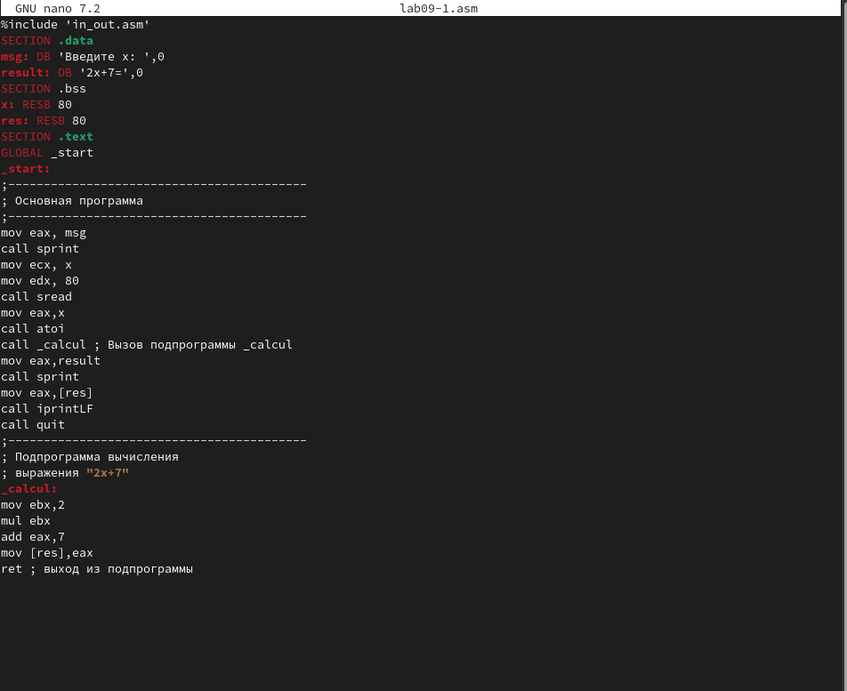{#fig:001  width=70%}

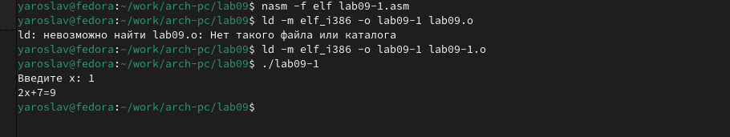{#fig:002  width=70%}

Изменил текст программы, добавив подпрограмму _subcalcul в подпрограмму _calcul,
для вычисления выражения f(g(x)), где x вводится с клавиатуры, f(x) = 2x + 7, g(x) =
3x − 1. Т.е. x передается в подпрограмму _calcul из нее в подпрограмму _subcalcul, где
вычисляется выражение g(x), результат возвращается в _calcul и вычисляется выражение
f(g(x))

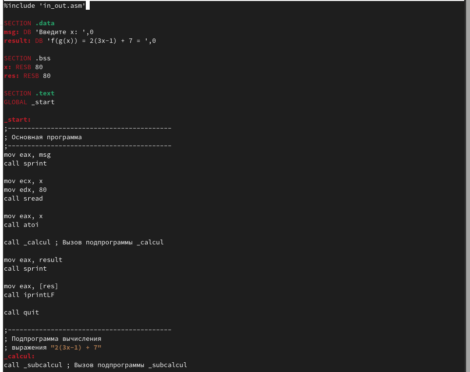{#fig:003  width=70%}

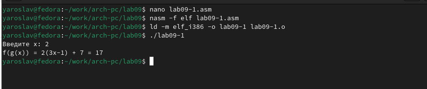{#fig:004  width=70%}

## Отладка программ с помощью GDB

Создал файл lab09-2.asm с текстом программы из Листинга 9.2. Получил исполняемый файл, загрузил его в отладчик gdb, проверил его работу.

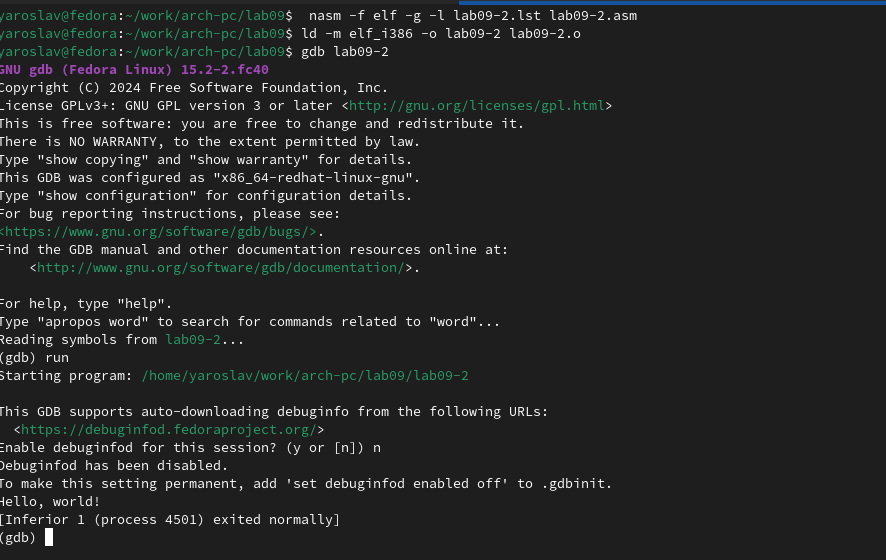{#fig:005  width=70%}

Для более подробного анализа программы установил брейкпоинт на метку _start, с
которой начинается выполнение любой ассемблерной программы, и запустил её.

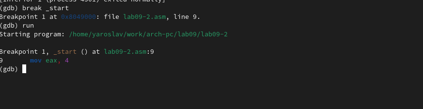{#fig:006  width=70%}

Посмотрел дисассимилированный код программы с помощью команды disassemble
начиная с метки _start, затем переключился на отображение команд с Intel’овским синтаксисом, введя команду set
disassembly-flavor inte

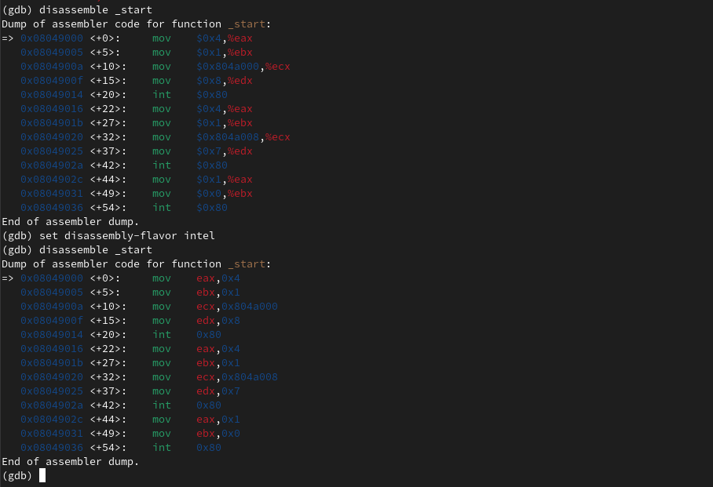{#fig:007  width=70%}

`Ответ на вопрос: Перечислите различия отображения синтаксиса машинных команд в режимах ATT и Intel:`
В режиме ATT операнды указываются в порядке "источник, назначение" и используют префиксы размеров данных (например, movl), в то время как в режиме Intel операнды указываются в порядке "назначение, источник" и размер данных указывается в имени команды.

Включил режим псевдографики для более удобного анализа программы

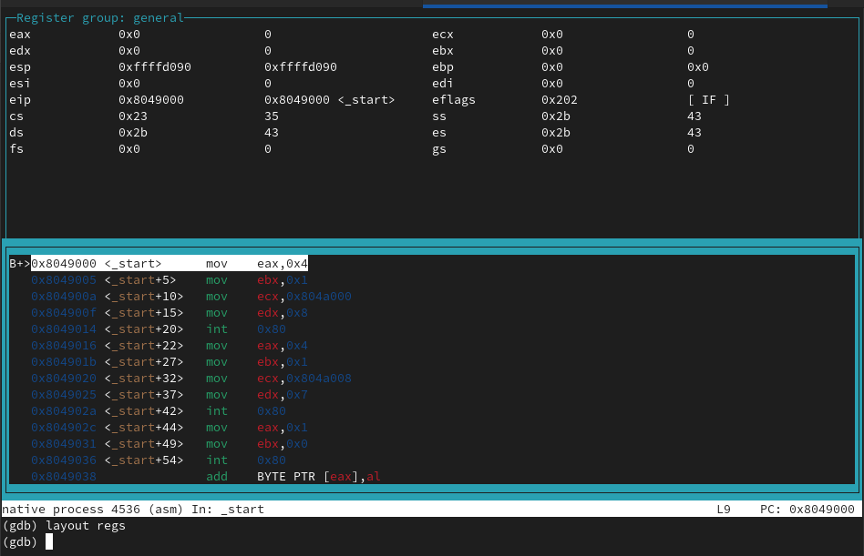{#fig:008  width=70%}

С помощью команды info breakpoint узнал о точке основы, а затем определил адрес предпоследней инструкции и установил ещё одну точку основы

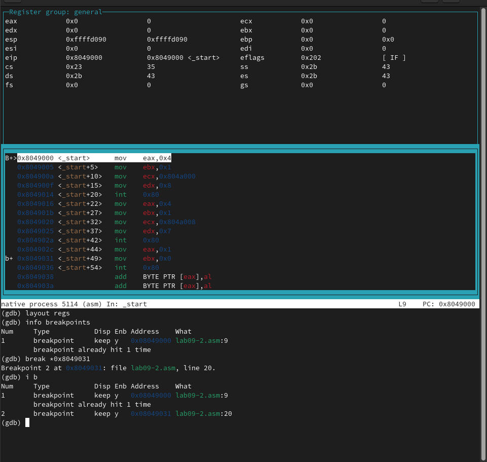{#fig:009  width=70%}

`Ответ на вопрос: Выполните 5 инструкций с помощью команды stepi. Значение каких регистров меняются?`
изменяются регистры RAX, RBX, RCX, RDX, RSI, RDI, RSP.

Посмотрел содержание регистров, а затем значение переменной msg1 и  значение msg2 по адресу.

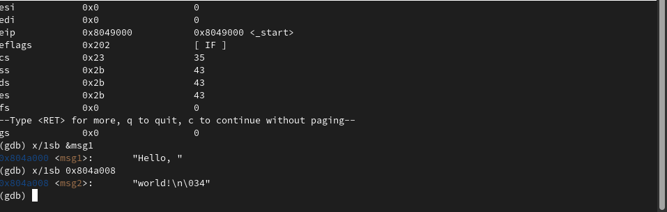{#fig:010  width=70%}

С помощью команды set изменил значения для переменной msg1 и изменил символ для переменной msg2.

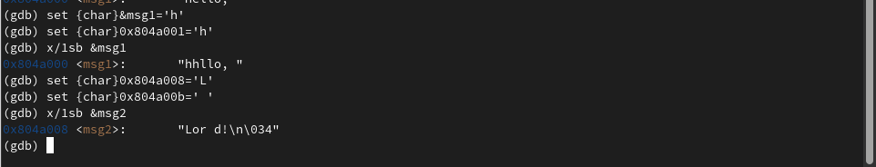{#fig:011  width=70%}

Изменил значения регистра ebx

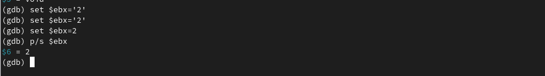{#fig:012  width=70%}

`Ответ на вопрос: Объясните разницу вывода команд p/s $ebx:`
При set $ebx='2' GDB интерпретирует '2' как символ с ASCII-кодом 50, а при set $ebx=2 — как число 2.

## Обработка аргументов командной строки в GDB
Скопировал файл lab8-2.asm в файл с именем lab09-3.asm, создал исполняемый файл, загрузил исполняемый файл в отладчик, установил точку основы и запустил её

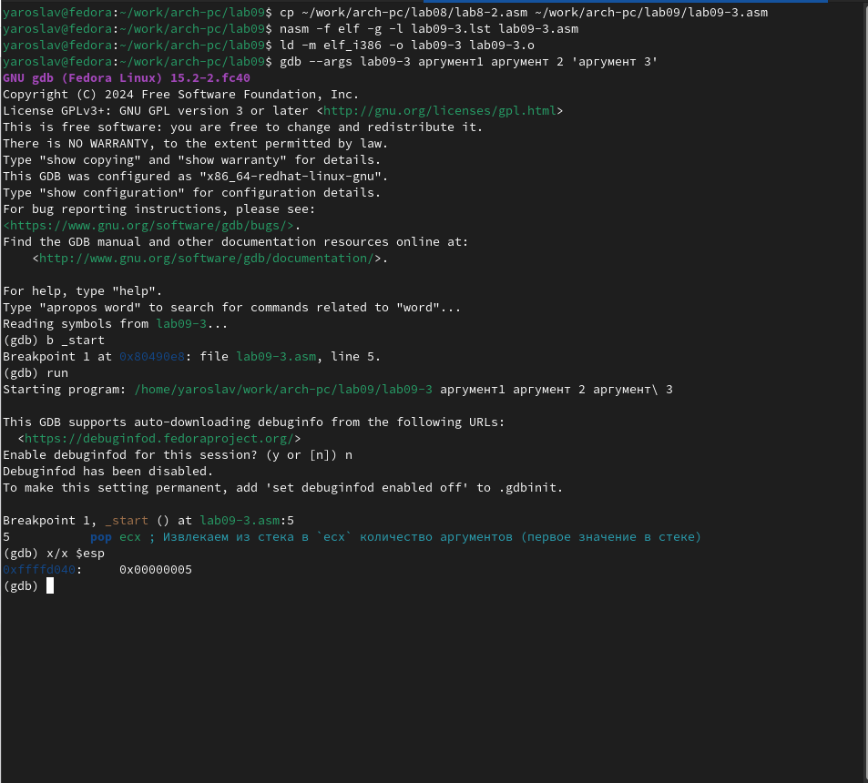{#fig:013  width=70%}

Посмотрел остальные позиции стека

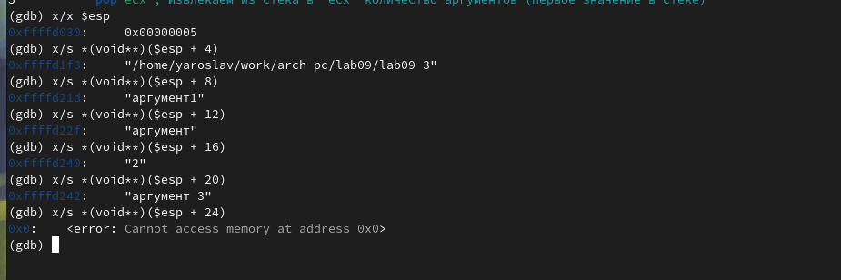{#fig:014  width=70%}

`Ответ на вопрос: Объясните, почему шаг изменения адреса равен 4 ([esp+4], [esp+8], [esp+12] и т.д.):`
Шаг изменения адреса равен 4, потому что указатели занимают 4 байта в 32-битной архитектуре.

##  Задания для самостоятельной работы:
Преобразуйте программу из лабораторной работы №8 (Задание №1 для самостоятель-
ной работы), реализовав вычисление значения функции f(x) как подпрограмму.

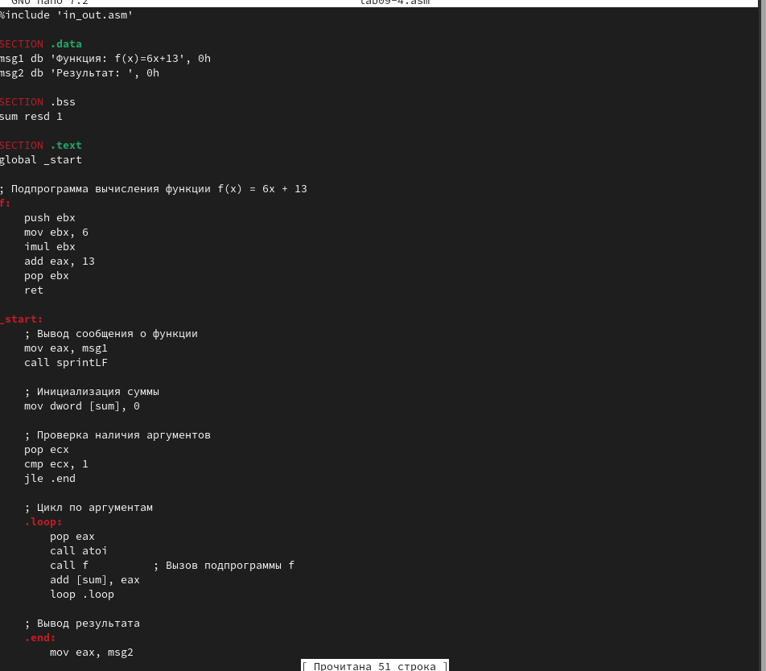{#fig:015  width=70%}

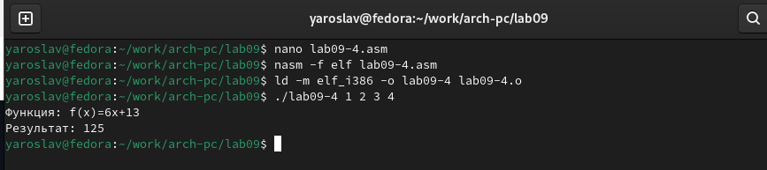{#fig:016  width=70%}

В листинге 9.3 приведена программа вычисления выражения (3 + 2) * 4 + 5. При запуске
данная программа дает неверный результат. Проверьте это. С помощью отладчика GDB,
анализируя изменения значений регистров, определите ошибку и исправьте ее.

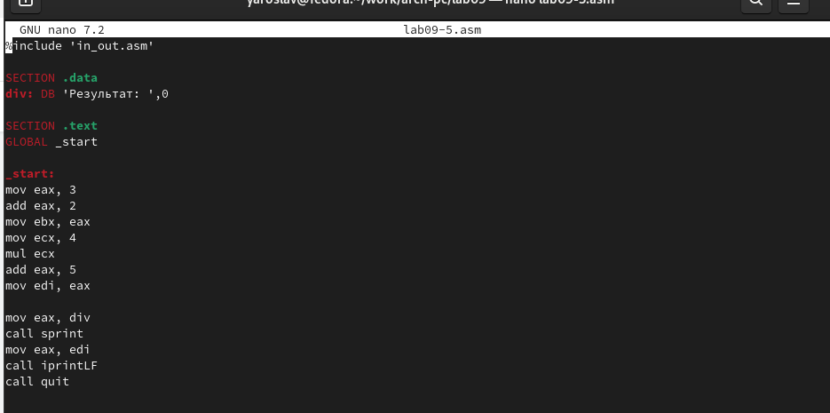{#fig:017  width=70%}

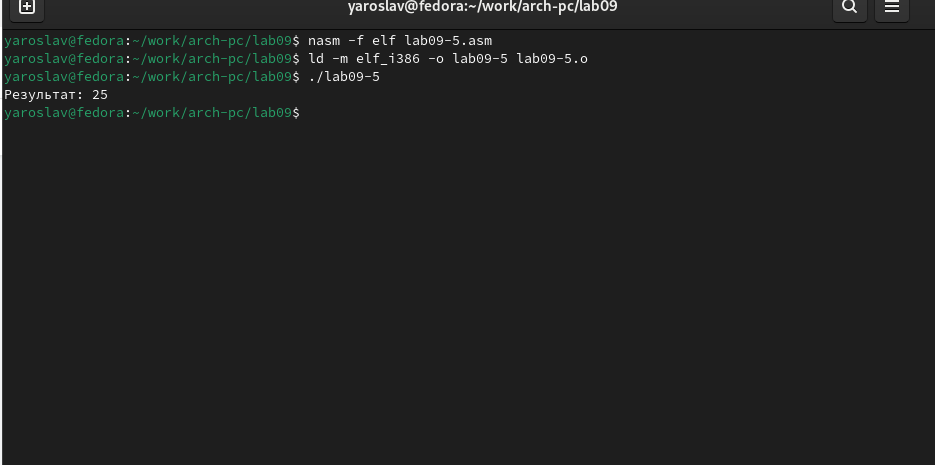{#fig:018  width=70%}

# Выводы
В ходе работы приобрел навыки написания программ с использованием подпрограмм. Познакомился с методами отладки при помощи GDB и его основными возможностями

