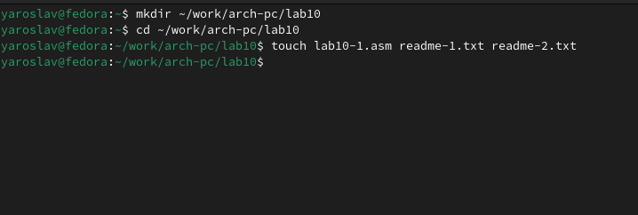
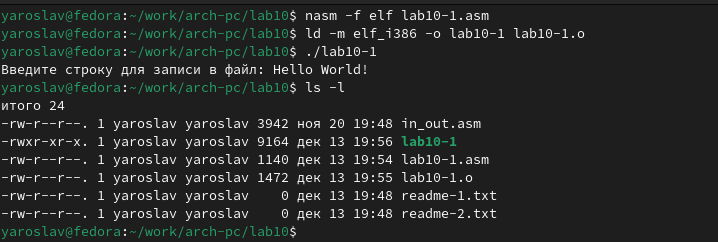
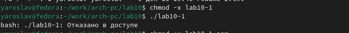
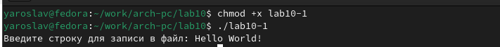
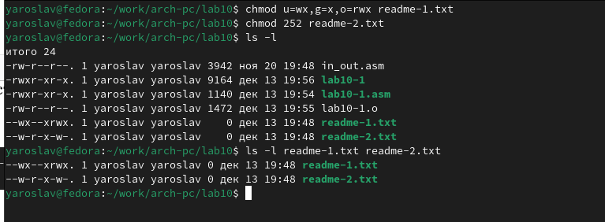
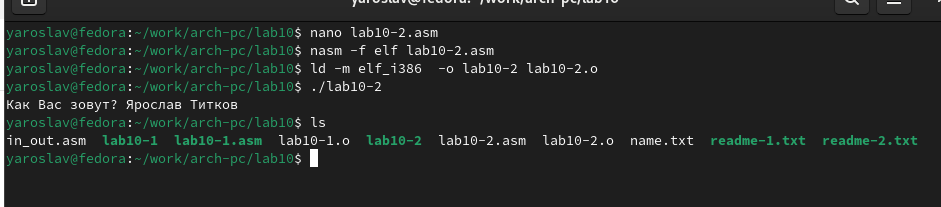
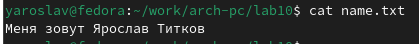

---
## Front matter
title: "Лабораторная работа номер 10"
subtitle: "Архитектура компьютера"
author: "Титков Ярослав Максимович"

## Generic otions
lang: ru-RU
toc-title: "Содержание"

## Bibliography
bibliography: bib/cite.bib
csl: pandoc/csl/gost-r-7-0-5-2008-numeric.csl

## Pdf output format
toc: true # Table of contents
toc-depth: 2
lof: true # List of figures
fontsize: 12pt
linestretch: 1.5
papersize: a4
documentclass: scrreprt
## I18n polyglossia
polyglossia-lang:
  name: russian
  options:
	- spelling=modern
	- babelshorthands=true
polyglossia-otherlangs:
  name: english
## I18n babel
babel-lang: russian
babel-otherlangs: english
## Fonts
mainfont: IBM Plex Serif
romanfont: IBM Plex Serif
sansfont: IBM Plex Sans
monofont: IBM Plex Mono
mathfont: STIX Two Math
mainfontoptions: Ligatures=Common,Ligatures=TeX,Scale=0.94
romanfontoptions: Ligatures=Common,Ligatures=TeX,Scale=0.94
sansfontoptions: Ligatures=Common,Ligatures=TeX,Scale=MatchLowercase,Scale=0.94
monofontoptions: Scale=MatchLowercase,Scale=0.94,FakeStretch=0.9
mathfontoptions:
## Biblatex
biblatex: true
biblio-style: "gost-numeric"
biblatexoptions:
  - parentracker=true
  - backend=biber
  - hyperref=auto
  - language=auto
  - autolang=other*
  - citestyle=gost-numeric
## Pandoc-crossref LaTeX customization
figureTitle: "Рис."
tableTitle: "Таблица"
listingTitle: "Листинг"
lofTitle: "Список иллюстраций"
lolTitle: "Листинги"
## Misc options
indent: true
header-includes:
  - \usepackage{indentfirst}
  - \usepackage{float} # keep figures where there are in the text
  - \floatplacement{figure}{H} # keep figures where there are in the text
---

# Цель работы
Приобретение навыков написания программ для работы с файлами.


# Задание

1. Создайте каталог для программам лабораторной работы № 10, перейдите в него и
создайте файлы 
2. Введите в файл lab10-1.asm текст программы из листинга 10.1 (Программа записи в
файл сообщения). Создайте исполняемый файл и проверьте его работу.
3. С помощью команды chmod измените права доступа к исполняемому файлу lab10-1,
запретив его выполнение. Попытайтесь выполнить файл. Объясните результат.
4. С помощью команды chmod измените права доступа к файлу lab10-1.asm с исходным
текстом программы, добавив права на исполнение. Попытайтесь выполнить его и
объясните результат.
5. В соответствии с вариантом в таблице 10.4 предоставить права доступа к файлу readme-
1.txt представленные в символьном виде, а для файла readme-2.txt – в двочном виде.
Проверить правильность выполнения с помощью команды ls -l
6. Задания для самостоятельной работы


# Теоретическое введение
В операционной системе GNU/Linux управление правами доступа к файлам и работа с ними являются ключевыми аспектами для обеспечения безопасности, гибкости и эффективности работы с данными. Эти механизмы позволяют защищать данные от несанкционированного доступа, а также предоставлять возможность совместной работы пользователей с файлами.

Права доступа к файлам

Права доступа к файлам в Linux определяют, какие действия (чтение, запись, выполнение) могут выполнять пользователи над файлами. Для каждого файла существует три категории пользователей:
1. **Владелец файла** — пользователь, создавший файл.
2. **Группа владельца** — группа, к которой принадлежит владелец файла.
3. **Остальные пользователи** — все остальные пользователи системы.

Права доступа задаются в виде троек битов (rwx), где:
- **r (read)** — разрешено чтение файла.
- **w (write)** — разрешена запись в файл.
- **x (execute)** — разрешено выполнение файла (если это исполняемый файл).

Если какое-либо право отсутствует, вместо соответствующей буквы ставится дефис (-). Например, права `rw-` означают, что файл можно читать и записывать, но нельзя выполнять.

Права доступа могут быть представлены как в символьном, так и в восьмеричном формате. Например:
- Символьный формат: `rwxr-xr--` (владелец может читать, записывать и выполнять, группа и остальные — только читать).
- Восьмеричный формат: `754` (111 101 100 в двоичной системе).

Для изменения прав доступа используется команда `chmod`. Например:
- `chmod 644 filename` — установить права `rw-r--r--` (владелец может читать и записывать, остальные — только читать).
- `chmod u+x filename` — добавить право выполнения для владельца.

Работа с файлами в Linux

В Linux работа с файлами осуществляется через системные вызовы, которые взаимодействуют с ядром операционной системы. Основные системные вызовы для работы с файлами:
1. **sys_open** — открывает существующий файл или создает новый.
2. **sys_creat** — создает новый файл.
3. **sys_write** — записывает данные в файл.
4. **sys_read** — читает данные из файла.
5. **sys_close** — закрывает файл.
6. **sys_unlink** — удаляет файл.
7. **sys_lseek** — изменяет позицию указателя в файле для чтения или записи.

Каждый файл имеет уникальный **дескриптор файла** — целое число, которое используется для идентификации файла при выполнении операций. Дескриптор возвращается системным вызовом при открытии или создании файла.

Пример работы с файлами на языке ассемблера NASM

Рассмотрим пример программы на языке ассемблера NASM, которая создает файл, записывает в него строку, читает её обратно и закрывает файл:

```asm
; Создание файла и запись в него строки
%include 'in_out.asm'
SECTION .data
filename db 'test.txt', 0h ; Имя файла
msg db 'Привет, мир!', 0h ; Сообщение для записи

SECTION .bss
fileContents resb 255 ; Буфер для чтения данных из файла

SECTION .text
global _start
_start:
    ; Создание файла
    mov ecx, 0777o ; Установка прав доступа (rwxrwxrwx)
    mov ebx, filename
    mov eax, 8 ; Системный вызов sys_creat
    int 80h

    ; Запись в файл
    mov edx, 12 ; Длина строки
    mov ecx, msg ; Адрес строки
    mov ebx, eax ; Дескриптор файла
    mov eax, 4 ; Системный вызов sys_write
    int 80h

    ; Закрытие файла
    mov ebx, eax ; Дескриптор файла
    mov eax, 6 ; Системный вызов sys_close
    int 80h

    ; Открытие файла для чтения
    mov ecx, 0 ; Режим доступа (только чтение)
    mov ebx, filename
    mov eax, 5 ; Системный вызов sys_open
    int 80h

    ; Чтение из файла
    mov edx, 255 ; Максимальное количество байтов для чтения
    mov ecx, fileContents ; Адрес буфера для данных
    mov ebx, eax ; Дескриптор файла
    mov eax, 3 ; Системный вызов sys_read
    int 80h

    ; Закрытие файла
    mov ebx, eax ; Дескриптор файла
    mov eax, 6 ; Системный вызов sys_close
    int 80h

    ; Вывод прочитанных данных на экран
    mov eax, fileContents
    call sprint

    ; Завершение программы
    call quit
```

Подробности работы программы

1. **Создание файла**:
   - Используется системный вызов `sys_creat` с номером 8.
   - В регистр `ECX` передаются права доступа (например, `0777o` для полного доступа).
   - В регистр `EBX` передается имя файла.
   - После вызова возвращается дескриптор файла в регистр `EAX`.

2. **Запись в файл**:
   - Используется системный вызов `sys_write` с номером 4.
   - В регистр `EDX` передается количество байтов для записи.
   - В регистр `ECX` передается адрес строки для записи.
   - В регистр `EBX` передается дескриптор файла.

3. **Чтение из файла**:
   - Используется системный вызов `sys_read` с номером 3.
   - В регистр `EDX` передается максимальное количество байтов для чтения.
   - В регистр `ECX` передается адрес буфера для данных.
   - В регистр `EBX` передается дескриптор файла.

4. **Закрытие файла**:
   - Используется системный вызов `sys_close` с номером 6.
   - В регистр `EBX` передается дескриптор файла.

5. **Удаление файла**:
   - Используется системный вызов `sys_unlink` с номером 10.
   - В регистр `EBX` передается имя файла.


# Выполнение лабораторной работы
##  Права доступа

Создал каталог для программ лаб.работы номер 10 и создал нужные файлы

{#fig:001  width=70%}

Ввёл в файл lab10-1.asm текст программы 10.1 и запустил её

{#fig:002  width=70%}

С помощью команды chmod изменил права доступа, а затем вернул их

{#fig:003  width=70%}

{#fig:004  width=70%}

`Объяснения результата:`Когда я добавляю права на исполнение к файлу .asm с помощью chmod +x, это позволяет запускать его как программу. Однако, файл .asm — это исходный код на языке ассемблера, а не готовая программа. Чтобы он мог выполняться, его нужно скомпилировать (преобразовать в объектный файл) и слинковать (создать исполняемый файл).

Предоставил  доступ к файлам readme1.txt и readme2.txt в соответствии с моим вариантом(15)

{#fig:005  width=70%}


##  Задания для самостоятельной работы:
Напишите программу работающую по следующему алгоритму:
• Вывод приглашения “Как Вас зовут?”

• ввести с клавиатуры свои фамилию и имя

• создать файл с именем name.txt

• записать в файл сообщение “Меня зовут”

• дописать в файл строку введенную с клавиатуры

• закрыть файл

Создать исполняемый файл и проверить его работу. Проверить наличие файла и его
содержимое с помощью команд ls и cat


{#fig:006  width=70%}

{#fig:007  width=70%}


# Выводы

Я приобрел навыки написания программ для работы с файлами.
